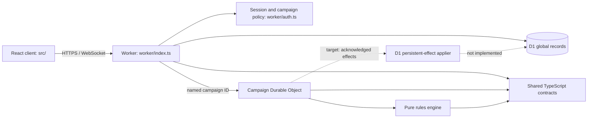

# Corinth's Plight Architecture

**Status:** Reconciled foundation decision record (2026-08-09)

**Scope:** The first implementation deliverable in `gameplan.md` section 56, not the complete-game success scenario in section 57

**V1 baseline:** commit `609ea9f50b4d595cfa07c2677d3eeb681d45d0ce`; see [V1_AUDIT.md](./V1_AUDIT.md)

## 1. Reading this document

This document distinguishes three states:

| Label | Meaning |
|---|---|
| **Implemented** | Present in the repository and exercised by the current TypeScript build or tests |
| **Target** | An accepted architecture decision that still needs implementation before production |
| **Deferred** | Outside the first foundation deliverable |

The current repository is a working local foundation and Outpost K-17 prototype. It is **not** yet a production-ready persistent game: production login, D1 effect finalisation, the complete retry journal, persisted schedule records, real Cloudflare resource IDs, and a remote deployment are still open.

## 2. Exact foundation milestone

`gameplan.md` section 56 requires seven repository documents followed by D1 migrations, ruleset seed data, core TypeScript domain models, a pure rules-engine skeleton, a Campaign Durable Object skeleton, an accelerated local campaign clock, and a basic hex-map prototype. It then requires a successful Cloudflare deployment before gameplay expansion.

| Deliverable | Repository evidence | Status |
|---|---|---|
| Seven design/audit documents | `docs/V1_AUDIT.md`, this document, `docs/GAME_SYSTEMS.md`, `docs/RULE_CONFLICTS.md`, `docs/DATA_MODEL.md`, `docs/ROUND_RESOLUTION.md`, `docs/CLOUDFLARE.md` | Implemented |
| D1 migrations | `migrations/0001_platform_and_rules.sql`, `migrations/0002_persistent_world.sql` | Implemented as schema artifacts |
| Ruleset seed | `seeds/v5-core-curated.sql`; consistency check in `scripts/validate-seed.ts` | Implemented as an idempotent SQL seed |
| Domain contracts | `packages/domain/src/index.ts` | Implemented TypeScript interfaces; runtime schemas are not yet present |
| Pure rules engine | `packages/rules-engine/src/` and `packages/rules-engine/test/` | Implemented foundation subset |
| Campaign DO skeleton | `worker/campaign-durable-object.ts` | Implemented for the explicit K-17 scenario |
| Accelerated clock | `worker/campaign-clock.ts` and its tests | Implemented, including manual/1m/5m/30m/24h presets |
| Basic hex-map prototype | `src/App.tsx`, `src/components/HexMap.tsx`, `src/components/Glyph.tsx` | Implemented |
| Successful remote Cloudflare deployment | Requires provisioned resources and a non-placeholder production D1 ID | **Open; milestone gate not yet passed** |

The full scenario in `gameplan.md` section 57—login, purchases, Battalion ship travel, deployment, exact-once permanent consequences, reports, and subsequent campaigns—is the product definition of success, not a claim about this foundation.

## 3. V1 baseline and strangler consequence

V1 is a Flask 3/Jinja/SQLAlchemy application with module-level state, SQLite fallback through `DATABASE_URL`, Flask-Login sessions, Flask-WTF CSRF, and Alembic scaffolding without migration versions. The audited flows work after adding two undeclared packages, but the repository also contains broken entry points, CSRF omissions, plaintext passwords, literal secrets, client-authored equipment JSON, and disconnected ship-builder/world-map prototypes.

Retain as product input:

- visual identity, artwork, portraits, planet imagery, and interaction ideas;
- the `UnitTemplate` versus `UserUnit` distinction;
- explicit Legion membership and the dossier, roster, directory, ship-builder, and map concepts.

Do not retain as authority:

- V1 passwords, secrets, sessions, free-form authorization roles, or client-authored statistics/equipment;
- filesystem/base64 upload storage, `create_all()` schema management, or destructive template reseeding;
- hard-coded Python rules or the Flask/Jinja runtime as the new backend.

The migration is a product-level strangler. `app/`, `shipbuilder/`, and `worldmap/` remain untouched reference implementations until a replacement workflow has authorization, migration reconciliation, and acceptance tests. There is no long-lived dual-write between V1 and D1.

## 4. Modular-monolith boundary



There are no independently deployed microservices. The client, Worker entry point, Campaign DO, shared contracts, and pure engine are one repository and release train with explicit dependency boundaries.

### 4.1 Actual repository boundaries

| Path | Current responsibility | Boundary |
|---|---|---|
| `src/` | React/Vite command interface and local UI state | May consume public contracts and projections; never authoritative game logic |
| `src/components/` | Hex map and reusable visual components | No D1/DO access |
| `worker/index.ts` | Public API composition, origin policy, authentication, D1 campaign authorization, named-DO forwarding, security headers | Browser never receives a DO stub |
| `worker/auth.ts` | Demo/session authentication, D1 membership lookup, trusted viewer headers | Demo mode is development-only; no V1 credential compatibility |
| `worker/campaign-durable-object.ts` | K-17 active state, orders, alarms, sockets, snapshots, events, resolution records, and projections | No implemented D1 persistent-force/economy writes |
| `worker/campaign-clock.ts` | Pure clock/schedule transitions | Schedule is currently embedded in `state/current`, not separate storage records |
| `worker/enemy-ai.ts` | Deterministic foundation enemy orders | No LLM or network dependency |
| `worker/http.ts` | JSON/no-store responses, body-size limit, JSON parsing | It does not provide general runtime schema validation or content-type enforcement |
| `packages/domain/src/` | Shared TypeScript interfaces and constants | Compile-time contracts only; not a runtime schema package yet |
| `packages/rules-engine/src/` | Pure catalogue, hex, mechanics, visibility, RNG, enemy/demo fixtures, and resolver | No storage, network, wall-clock reads, or `Math.random()` |
| `packages/rules-engine/test/` | Pure engine fixtures and regression tests | No live Cloudflare integration |
| `migrations/` | The two ordered D1 SQL migrations | No new runtime uses the legacy Alembic files also retained in this directory |
| `seeds/v5-core-curated.sql` | Current D1 rules/source/conflict seed | Definitions only; no live campaign mutation |
| `scripts/validate-seed.ts` | Source-digest, definition-ID/status, and seed-presence checks | It is a validator, not a D1 importer or full content-hash proof |
| `wrangler.jsonc`, `vite.config.ts` | Worker/DO/D1 environments and Vite/Cloudflare composition | Production D1 ID is deliberately still a placeholder |
| `app/`, `shipbuilder/`, `worldmap/` | V1 reference during strangler migration | Not imported into the Worker |

There is no `src/data/`, `worker/demo.ts`, or `scripts/seed-ruleset.ts` in this foundation. Demo authentication lives in `worker/auth.ts`; the only seed runner is Wrangler executing `seeds/v5-core-curated.sql` through package scripts.

### 4.2 Dependency direction

```text
src -----------------------> packages/domain
worker/index --------------> packages/domain, packages/rules-engine
CampaignDurableObject -----> packages/domain, packages/rules-engine
packages/rules-engine -----> packages/domain
```

Domain and engine packages must not import React, D1, Durable Objects, or Node-only runtime APIs. A client preview may reuse a calculation only with already-visible inputs; the server recalculates authoritatively.

## 5. Implemented request and security flow

For `/api/campaigns/{campaignId}/*` the current Worker:

1. rejects an unsafe production auth configuration;
2. requires an exact same-origin `Origin` for mutations and WebSocket upgrades, and rejects explicitly cross-origin API requests;
3. authenticates either an explicitly enabled development demo identity or a SHA-256-digested `corinth_session` row joined to an `ACTIVE` user;
4. allows the demo identity only when `ENVIRONMENT=development`, `ALLOW_DEMO_AUTH=true`, and the campaign is exactly `outpost-k17`;
5. for session identities, reads an existing campaign and membership from D1 before resolving a DO name; only `ACTIVE`, `PAUSED`, `COMPLETE`, or `FAILED` campaigns route;
6. maps campaign `PLAYER`, `BATTALION_COMMAND`, and `GM` roles to supported viewer contexts; `OBSERVER` and unsafe neutral projections fail closed;
7. strips cookies, authorization/demo inputs, and client-supplied internal viewer headers before adding server-derived viewer headers;
8. routes to `CAMPAIGN.getByName(campaignId)`.

The DO itself initialises state only when its name is exactly `outpost-k17`; an arbitrary DO name no longer creates a demo campaign. A registered non-K-17 D1 campaign still needs a production bootstrap/deployment-snapshot workflow—currently it reaches an uninitialised DO and fails rather than inventing state.

Current order commands derive start position, class eligibility, executable order/action definitions, action economy/speed cost, fitted weapons/equipment, owner, current visible target IDs, and one-attack limits on the server. The pure resolver independently rechecks the pinned ruleset, executable definitions, routes, speed/action budget, attack count, targets, weapons, LOS/range, ammo, cooldown, and friendly-fire rules.

Still target rather than implemented:

- general runtime request schemas and versioned public DTO schemas;
- client command idempotency keys and expected-revision compare-and-set;
- delegated Battalion command and production-grade admin audit;
- production login/provider, session issuance/rotation/logout/recovery, and account migration;
- an events-after-sequence reconnect endpoint.

## 6. D1 and Campaign DO ownership

| Concern | Implemented owner now | Target owner |
|---|---|---|
| Users, session validation, campaign registry/membership | D1, read by Worker | D1 |
| Rules, source provenance, conflict and persistent-world table shapes | D1 migrations/seed exist; runtime rules are also compiled in `catalogue.ts` | D1-pinned immutable rules plus a verified compiled engine interpretation |
| Player Units, requisition, Battalions, ships, deployments, archives | D1 tables exist; service workflows are mostly absent | D1 transactional global truth |
| K-17 active battlefield, current orders, clock, event log | Campaign DO | One named DO per active campaign |
| Round snapshot/result deduplication | `snapshot/{round}` and `resolution/{round}` in DO storage | PREPARED/committed hash journal in DO storage |
| Scheduled lock/resolve items | Embedded in `state/current.clock.schedule`; one DO alarm | Separate durable `schedule/{id}` records with status/history |
| Persistent consequences | Resolver emits and DO stores `pending-effect/{id}` | Idempotent D1 applier and acknowledgement before next round |

The current DO transaction writes the snapshot, result state, resolution record, events, and pending-effect records atomically in DO storage. It then opens the next round immediately. It does **not** apply or acknowledge `persistent_effects` in D1. Therefore the architecture's intended cross-store exactly-once invariant is not yet satisfied; see [ROUND_RESOLUTION.md](./ROUND_RESOLUTION.md).

No authoritative state belongs in process globals, browser storage, WebSocket delivery, or KV. R2 and Queues are optional future boundaries described in [CLOUDFLARE.md](./CLOUDFLARE.md).

## 7. Resolver and fog status

The implemented engine foundation now:

- continues event sequence numbers after events already in the round;
- resolves accepted order revisions without marking future/replacement revisions resolved;
- ticks old cooldowns before attacks so a newly assigned cooldown survives the round;
- applies Hold facing even when no movement occurs;
- blocks all simultaneously over-capacity arrivals consistently and ignores destroyed/withdrawn occupants;
- supports deterministic Hold, Advance, Rush, and Attack only; catalogued advanced orders/actions fail closed;
- derives indirect-fire legality from an eligible friendly spotter and aggregates combat damage before casualty application.

Projection removes resolution records and pending effects, hides non-visible deployments, keeps other users' drafts private, and redacts dynamic control/objective/structure/environment fields on wholly unknown hexes. Reports pass stored events through the same current projector and do not expose the stored seed.

This is not yet a complete fog/replay security proof. `CampaignView` is still largely the canonical state minus two fields; event filtering uses present-time actor visibility rather than event-time intelligence; public event payloads can contain target IDs; and generic WebSocket broadcasts are not yet separately projected per audience and may include order/unit identifiers. Production acceptance needs explicit safe DTOs, event-field redaction, event-time/declassification policy, report tests, and per-audience socket messages.

## 8. V1 strangler sequence

1. Preserve the audited V1 commit and its smoke evidence.
2. Run the root Vite/Worker system beside `app/`, `shipbuilder/`, and `worldmap/`.
3. Treat V1 prose/data as sourced legacy or experimental catalogue input, not active truth.
4. Replace identity/profile, persistent forces/requisition, Battalion/ship, campaign/deployment, orders, then resolution as tested vertical slices.
5. Use a one-way repeatable importer with legacy-ID mapping; never import plaintext credentials.
6. Cut over each capability only after authorization, data reconciliation, rollback, and acceptance tests.
7. Remove V1 from deployment only when all retained workflows have replacements; retain source/history for audit.

## 9. Architecture decisions

### ADR-A01: Modular monolith

**Status:** Accepted and implemented for the foundation.

**Decision:** One repository/release with client, Worker, campaign DO, domain, and engine boundaries.

**Trade-off:** Boundaries rely on code review/tests rather than network isolation.

**Revisit:** Extract only when a stable module demonstrably needs independent scale or release cadence.

### ADR-A02: Product-level strangler migration

**Status:** Accepted; migration work remains.

**Decision:** Retain V1 as reference and replace tested workflows without dual-writing.

**Trade-off:** Two stacks remain in the repository temporarily.

**Revisit:** Archive V1 outside the deployed tree once every retained workflow is replaced.

### ADR-A03: D1 global truth plus one DO per campaign

**Status:** Boundary implemented; cross-store effect protocol is target.

**Decision:** D1 owns global relationships/economy; one DO serialises active campaign state.

**Trade-off:** Correct permanent consequences require an explicit idempotent journal across stores.

**Revisit:** Only for measured platform limits or a future transactional primitive spanning both resources.

### ADR-A04: Current snapshots plus append-only events

**Status:** Partially implemented.

**Decision:** Current state is authoritative; snapshots/events explain rounds without full event sourcing.

**Trade-off:** Historical reconstruction depends on retained snapshots and mature event schemas.

**Revisit:** If arbitrary temporal queries/reprojection become core product requirements.

### ADR-A05: Rules values in data, mechanics in pure handlers

**Status:** Partially implemented.

**Decision:** D1 seed stores versioned values/provenance; pure code implements named mechanics.

**Trade-off:** New mechanics still require code. The current D1 seed and compiled catalogue are two representations, and `seed:check` does not prove full field equivalence.

**Revisit:** Add a generated single source or stronger hash/schema pipeline before more catalogue breadth creates drift.

### ADR-A06: Replace V1 authentication before real-account migration

**Status:** Fail-closed boundary implemented; production provider deferred.

**Decision:** V1 credentials never cross into the new authority. Demo auth is explicit local-only; production requires a secure provider/session lifecycle.

**Trade-off:** There is no production login yet.

**Revisit:** This must be resolved before preview users, public deployment, or account migration.

## 10. Foundation readiness

| Check | Status | Evidence or remaining work |
|---|---|---|
| Package skeleton, TypeScript, lint, unit tests, local production build | Complete | Root package scripts |
| Migrations and idempotent seed artifact | Complete locally as artifacts | Two SQL migrations, one SQL seed, `seed:check` |
| Deterministic resolver subset and regression coverage | Complete for the stated subset | Hold/Advance/Rush/Attack engine tests |
| K-17 state, alarms, clock, pause/resume, sockets | Partial | Unit coverage exists; crash/alarm/WebSocket integration coverage does not |
| Viewer projection | Partial | Basic state/report redaction exists; event-time and socket-field leakage tests remain |
| D1 persistent-effect applier and next-round gate | Open | Pending effects are stored but never applied/acknowledged |
| PREPARED journal, cryptographic input/output hashes, secret seed commitment | Open | Current record is a committed snapshot with a predictable seed and 32-bit digest |
| Separate persisted schedule records and reconnect catch-up | Open | Schedule lives inside current state; no events-after-sequence API |
| Production login/provider/session issuance | Open | Existing session rows can be validated only |
| Real preview/production D1 IDs | Blocked by provisioning | Wrangler IDs are placeholders; production guard intentionally fails |
| Remote preview/production deployment | Not performed | The section 56 deployment gate is therefore still open |

Gameplay expansion should not be described as production-ready until the open correctness and deployment gates above are closed.
