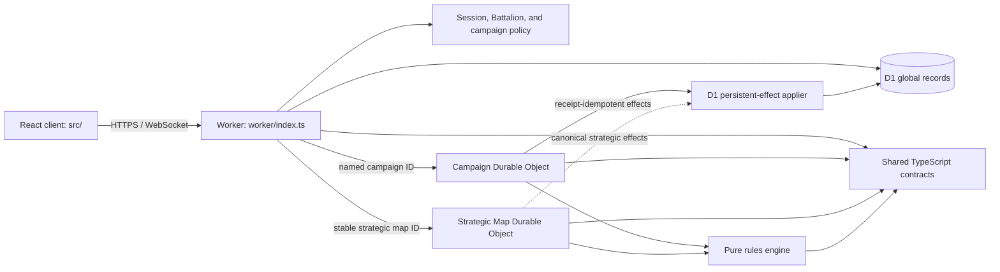

# Corinth's Plight Architecture

**Status:** Reconciled Phase 1–3 foundation decision record (2026-08-10)

**Scope:** The original foundation milestone plus additive Phase 2 persistent forces, Phase 3 strategic war, and the equipment/deployment vertical slice; not the complete Phase 3 success scenario

**V1 baseline:** commit `609ea9f50b4d595cfa07c2677d3eeb681d45d0ce`; see [V1_AUDIT.md](./V1_AUDIT.md)

## 1. Reading this document

This document distinguishes three states:

| Label | Meaning |
|---|---|
| **Implemented** | Present in the repository and exercised by the current TypeScript build or tests |
| **Target** | An accepted architecture decision that still needs implementation before production |
| **Deferred** | Outside the first foundation deliverable |

The current repository is a deployed Phase 3/equipment foundation with local K-17, Corinth strategic, and Spearhead fixtures. It is **not** yet the complete production game: production login, production scenario bootstrap, tactical-to-strategic effect finalisation, complete retry journals, and full withdrawal/redeployment remain open.

## 2. Exact foundation milestone

`gameplan.md` section 56 requires seven repository documents followed by D1 migrations, ruleset seed data, core TypeScript domain models, a pure rules-engine skeleton, a Campaign Durable Object skeleton, an accelerated local campaign clock, and a basic hex-map prototype. It then requires a successful Cloudflare deployment before gameplay expansion.

| Deliverable | Repository evidence | Status |
|---|---|---|
| Foundation and Phase 3 design/audit documents | Original seven documents plus `STRATEGIC_LAYER.md`, `BATTALION_MODEL.md`, `SHIP_SYSTEM.md`, and `STRATEGIC_RESOLUTION.md` | Implemented |
| D1 migrations | `migrations/0001_platform_and_rules.sql` through `0006_production_identity.sql` | Implemented as additive schema artifacts and applied through `0006` in production |
| Ruleset seed | `seeds/v5-core-curated.sql`; consistency check in `scripts/validate-seed.ts` | Implemented as an idempotent SQL seed |
| Domain contracts | `packages/domain/src/index.ts` | Implemented TypeScript interfaces; runtime schemas are not yet present |
| Pure rules engine | `packages/rules-engine/src/` and `packages/rules-engine/test/` | Implemented foundation subset |
| Campaign DO skeleton | `worker/campaign-durable-object.ts` | Implemented for K-17 plus fail-closed bootstrap from committed deployment snapshots |
| Accelerated clock | `worker/campaign-clock.ts` and its tests | Implemented, including manual/1m/5m/30m/24h presets |
| Basic hex-map prototype | `src/App.tsx`, `src/components/HexMap.tsx`, `src/components/Glyph.tsx` | Implemented |
| Phase 2 persistent forces | `0003`, the combined-arms catalogue/fixture, typed force services and UI | Implemented checkpoint; not every catalogue mutation is active |
| Phase 3 strategic schema/world | `0004`, `development-strategic-world.sql`, and the four Phase 3 design documents | Implemented local checkpoint |
| Strategic resolver/API/UI | Domain, pure-engine, Worker, and responsive strategic workspace files | Checkpoint work; verify landed tests before release |
| Equipment/loadout/deployment slice | `0005`, canonical equipment seed, pure engine, Worker services, planner/force UI, and Spearhead fixture | Implemented release candidate; broader Store content remains blocked |
| Public home and production identity slice | Public React gateway, Resend passwordless services/routes, opaque sessions, and `0006` | Implemented and deployed; live Resend delivered-test passed |
| Successful remote foundation deployment | Production D1 is migrated through `0006`; Phase 3/equipment/identity Worker and UI are available at `corinthplight.qnetica.com.au` | Implemented on 2026-08-10; production scenario data remains open |

The full Phase 3 scenario—production account creation, invitation, purchase, ship travel, deployment into a tactical campaign, exact-once permanent strategic consequences, recovery, and redeployment—is the product definition of success, not a claim about this checkpoint.

## 3. V1 baseline and strangler consequence

V1 is a Flask 3/Jinja/SQLAlchemy application with module-level state, SQLite fallback through `DATABASE_URL`, Flask-Login sessions, Flask-WTF CSRF, and Alembic scaffolding without migration versions. The audited flows work after adding two undeclared packages, but the repository also contains broken entry points, CSRF omissions, plaintext passwords, literal secrets, client-authored equipment JSON, and disconnected ship-builder/world-map prototypes.

Retain as product input:

- visual identity, artwork, portraits, planet imagery, and interaction ideas;
- the `UnitTemplate` versus `UserUnit` distinction;
- explicit Legion membership and the dossier, roster, directory, ship-builder, and map concepts.

Do not retain as authority:

- V1 passwords, secrets, sessions, free-form authorization roles, or client-authored statistics/equipment;
- filesystem/base64 upload storage, `create_all()` schema management, or destructive template reseeding;
- hard-coded Python rules or the Flask/Jinja runtime as the new backend.

The migration is a product-level strangler. `app/`, `shipbuilder/`, and `worldmap/` remain untouched reference implementations until a replacement workflow has authorization, migration reconciliation, and acceptance tests. There is no long-lived dual-write between V1 and D1.

## 4. Modular-monolith boundary



There are no independently deployed microservices. The client, Worker entry point, Campaign and Strategic Map Durable Objects, shared contracts, and pure engine are one repository and release train with explicit dependency boundaries.

### 4.1 Actual repository boundaries

| Path | Current responsibility | Boundary |
|---|---|---|
| `src/` | React/Vite command interface and local UI state | May consume public contracts and projections; never authoritative game logic |
| `src/components/` | Hex map and reusable visual components | No D1/DO access |
| `worker/index.ts` | Public API composition, origin policy, authentication, D1 campaign authorization, named-DO forwarding, security headers | Browser never receives a DO stub |
| `worker/auth.ts` | Demo/session authentication, D1 membership lookup, trusted viewer headers | Demo mode is development-only; no V1 credential compatibility |
| `worker/campaign-durable-object.ts` | Campaign state, committed-snapshot bootstrap, orders, alarms, sockets, resolution, projections, and narrow receipt-idempotent D1 writeback | Next-round acknowledgement gate and cryptographic effect journal remain open |
| `worker/campaign-clock.ts` | Pure clock/schedule transitions | Schedule is currently embedded in `state/current`, not separate storage records |
| `worker/strategic-*` | Strategic request policy/validation/clock and map coordination as landed | Must remain map-sharded and permission scoped; no global game object |
| `worker/enemy-ai.ts` | Deterministic foundation enemy orders | No LLM or network dependency |
| `worker/http.ts` | JSON/no-store responses, body-size limit, JSON parsing | It does not provide general runtime schema validation or content-type enforcement |
| `packages/domain/src/` | Shared TypeScript interfaces and constants | Compile-time contracts only; not a runtime schema package yet |
| `packages/rules-engine/src/` | Pure catalogue, hex, mechanics, visibility, RNG, enemy/demo fixtures, and resolver | No storage, network, wall-clock reads, or `Math.random()` |
| `packages/rules-engine/test/` | Pure engine fixtures and regression tests | No live Cloudflare integration |
| `migrations/` | Five ordered additive D1 SQL migrations | No new runtime uses the legacy Alembic files also retained in this directory |
| `seeds/v5-core-curated.sql`, `seeds/v5-phase2-combined-arms.sql` | Versioned D1 rules/source/conflict catalogue | Definitions only; availability overlays distinguish executable/catalogue state |
| `seeds/development-forces.sql`, `seeds/development-strategic-world.sql` | Explicit local-only Phase 2/3 fixtures | Never production data or automatically canonical lore |
| `scripts/validate-seed.ts` | Source-digest, catalogue, Phase 2, and Phase 3 seed-presence checks | It is a validator, not a D1 importer or full content-hash proof |
| `wrangler.jsonc`, `vite.config.ts` | Worker/DO/D1 environments and Vite/Cloudflare composition | Production D1 is provisioned; local/preview placeholder IDs are non-production bindings |
| `app/`, `shipbuilder/`, `worldmap/` | V1 reference during strangler migration | Not imported into the Worker |

Demo authentication lives in `worker/auth.ts`. Wrangler package scripts apply the core/Phase 2 catalogues separately from the two explicit development fixtures.

### 4.2 Dependency direction

```text
src -----------------------> packages/domain
worker/index --------------> packages/domain, packages/rules-engine
CampaignDurableObject -----> packages/domain, packages/rules-engine
StrategicMapDurableObject -> packages/domain, packages/rules-engine
packages/rules-engine -----> packages/domain
```

Domain and engine packages must not import React, D1, Durable Objects, or Node-only runtime APIs. A client preview may reuse a calculation only with already-visible inputs; the server recalculates authoritatively.

## 5. Implemented request and security flow

For `/api/campaigns/{campaignId}/*` the current Worker:

1. rejects an unsafe production auth configuration;
2. requires an exact same-origin `Origin` for mutations and WebSocket upgrades, and rejects explicitly cross-origin API requests;
3. authenticates either an explicitly enabled development demo identity or a SHA-256-digested `corinth_session` row joined to an `ACTIVE` user;
4. allows the demo identity only when `ENVIRONMENT=development`, `ALLOW_DEMO_AUTH=true`, and the campaign is an explicit local fixture (`outpost-k17` or `operation-spearhead`);
5. for session identities, reads an existing campaign and membership from D1 before resolving a DO name; only `ACTIVE`, `PAUSED`, `COMPLETE`, or `FAILED` campaigns route;
6. maps campaign `PLAYER`, `BATTALION_COMMAND`, and `GM` roles to supported viewer contexts; `OBSERVER` and unsafe neutral projections fail closed;
7. strips cookies, authorization/demo inputs, and client-supplied internal viewer headers before adding server-derived viewer headers;
8. routes to `CAMPAIGN.getByName(campaignId)`.

The DO self-initialises demo state only for `outpost-k17`. A registered non-K-17 campaign initialises only from committed D1 deployment snapshots; without them it fails rather than inventing forces.

Current order commands derive start position, class eligibility, executable order/action definitions, action economy/speed cost, fitted weapons/equipment, owner, current visible target IDs, and one-attack limits on the server. The pure resolver independently rechecks the pinned ruleset, executable definitions, routes, speed/action budget, attack count, targets, weapons, LOS/range, ammo, cooldown, and friendly-fire rules.

Still target rather than implemented:

- general runtime request schemas and versioned public DTO schemas;
- client command idempotency keys and expected-revision compare-and-set;
- delegated Battalion command and production-grade admin audit;
- production login/provider, session issuance/rotation/logout/recovery, and account migration;
- an events-after-sequence reconnect endpoint.

### 5.1 Phase 3 organisation and strategic request flow

Strategic requests use global session identity and explicit current-Battalion context. Read repositories include owner/Battalion predicates. Mutations additionally require exact rank permission, actor-scoped `commandId`, canonical request hash, expected revision, bounded/shape-validated JSON, and same-origin/CSRF protection. A client-supplied User, Battalion, rank, permission, route cost, capability, or supply result is never authority.

`user_active_battalions` is navigation context, not an authorization cache: each request rechecks active membership. Where revealing an ID would leak another Battalion's assets, a failed owner predicate returns not found.

The stable strategic coordinator name comes from `strategic_maps.coordinator_key`; the development value is `strategic-map-corinth`. No request may derive a singleton `GLOBAL_GAME_DURABLE_OBJECT` name.

## 6. D1 and Campaign DO ownership

| Concern | Implemented owner now | Target owner |
|---|---|---|
| Users, session validation, campaign registry/membership | D1, read by Worker | D1 |
| Rules, source provenance, conflict and persistent-world table shapes | D1 migrations/seed exist; runtime rules are also compiled in `catalogue.ts` | D1-pinned immutable rules plus a verified compiled engine interpretation |
| Player Units, requisition, Battalions, ships, deployments, archives | D1 tables exist; service workflows are mostly absent | D1 transactional global truth |
| Strategic locations/maps/nodes/routes, operations, formations, supply, rounds, orders, events, receipts, war variables | D1 migration and local fixture exist; checkpoint services use only their landed subset | D1 transactional strategic truth |
| K-17 active battlefield, current orders, clock, event log | Campaign DO | One named DO per active campaign |
| Strategic round/order coordination | Phase 3 map-sharded coordinator boundary | One named Strategic Map DO per tightly coordinated map/theatre |
| Round snapshot/result deduplication | `snapshot/{round}` and `resolution/{round}` in DO storage | PREPARED/committed hash journal in DO storage |
| Scheduled lock/resolve items | Embedded in `state/current.clock.schedule`; one DO alarm | Separate durable `schedule/{id}` records with status/history |
| Persistent consequences | Resolver emits/stores `pending-effect/{id}` and applies supported effects with a D1 receipt | Add cryptographic payload journal, automatic reconciliation, and acknowledgement before next round |

The current DO transaction writes the snapshot, result state, resolution record, events, and pending-effect records atomically in DO storage, then attempts an idempotent D1 batch and deletes each pending record after receipt verification. It still opens the next round before that acknowledgement and lacks a payload-hash/attempt journal, so the intended cross-store exactly-once invariant is not yet fully satisfied; see [ROUND_RESOLUTION.md](./ROUND_RESOLUTION.md).

No authoritative state belongs in process globals, browser storage, WebSocket delivery, or KV. R2 and Queues are optional future boundaries described in [CLOUDFLARE.md](./CLOUDFLARE.md).

## 7. Resolver and fog status

The implemented engine foundation now:

- continues event sequence numbers after events already in the round;
- resolves accepted order revisions without marking future/replacement revisions resolved;
- ticks old cooldowns before attacks so a newly assigned cooldown survives the round;
- applies Hold facing even when no movement occurs;
- blocks all simultaneously over-capacity arrivals consistently and ignores destroyed/withdrawn occupants;
- supports deterministic Hold, Advance, Rush, and Attack only; catalogued advanced orders/actions fail closed;
- derives indirect-fire legality from an eligible friendly spotter and aggregates combat damage before casualty application.

Projection removes resolution records and pending effects, hides non-visible deployments, keeps other users' drafts private, and redacts dynamic control/objective/structure/environment fields on wholly unknown hexes. Reports pass stored events through the same current projector and do not expose the stored seed.

This is not yet a complete fog/replay security proof. `CampaignView` is still largely the canonical state minus two fields; event filtering uses present-time actor visibility rather than event-time intelligence; public event payloads can contain target IDs; and generic WebSocket broadcasts are not yet separately projected per audience and may include order/unit identifiers. Production acceptance needs explicit safe DTOs, event-field redaction, event-time/declassification policy, report tests, and per-audience socket messages.

## 8. V1 strangler sequence

1. Preserve the audited V1 commit and its smoke evidence.
2. Run the root Vite/Worker system beside `app/`, `shipbuilder/`, and `worldmap/`.
3. Treat V1 prose/data as sourced legacy or experimental catalogue input, not active truth.
4. Replace identity/profile, persistent forces/requisition, Battalion/ship, campaign/deployment, orders, then resolution as tested vertical slices.
5. Use a one-way repeatable importer with legacy-ID mapping; never import plaintext credentials.
6. Cut over each capability only after authorization, data reconciliation, rollback, and acceptance tests.
7. Remove V1 from deployment only when all retained workflows have replacements; retain source/history for audit.

## 9. Architecture decisions

### ADR-A01: Modular monolith

**Status:** Accepted and implemented for the foundation.

**Decision:** One repository/release with client, Worker, campaign DO, domain, and engine boundaries.

**Trade-off:** Boundaries rely on code review/tests rather than network isolation.

**Revisit:** Extract only when a stable module demonstrably needs independent scale or release cadence.

### ADR-A02: Product-level strangler migration

**Status:** Accepted; migration work remains.

**Decision:** Retain V1 as reference and replace tested workflows without dual-writing.

**Trade-off:** Two stacks remain in the repository temporarily.

**Revisit:** Archive V1 outside the deployed tree once every retained workflow is replaced.

### ADR-A03: D1 global truth plus one DO per campaign

**Status:** Boundary implemented; cross-store effect protocol is target.

**Decision:** D1 owns global relationships/economy; one DO serialises active campaign state.

**Trade-off:** Correct permanent consequences require an explicit idempotent journal across stores.

**Revisit:** Only for measured platform limits or a future transactional primitive spanning both resources.

### ADR-A04: Current snapshots plus append-only events

**Status:** Partially implemented.

**Decision:** Current state is authoritative; snapshots/events explain rounds without full event sourcing.

**Trade-off:** Historical reconstruction depends on retained snapshots and mature event schemas.

**Revisit:** If arbitrary temporal queries/reprojection become core product requirements.

### ADR-A05: Rules values in data, mechanics in pure handlers

**Status:** Partially implemented.

**Decision:** D1 seed stores versioned values/provenance; pure code implements named mechanics.

**Trade-off:** New mechanics still require code. The current D1 seed and compiled catalogue are two representations, and `seed:check` does not prove full field equivalence.

**Revisit:** Add a generated single source or stronger hash/schema pipeline before more catalogue breadth creates drift.

### ADR-A06: Replace V1 authentication before real-account migration

**Status:** Fail-closed boundary implemented; production provider deferred.

**Decision:** V1 credentials never cross into the new authority. Demo auth is explicit local-only; production requires a secure provider/session lifecycle.

**Trade-off:** There is no production login yet.

**Revisit:** This must be resolved before preview users, public deployment, or account migration.

### ADR-A07: D1 strategic truth plus one coordinator per strategic map

**Status:** Accepted; additive schema/fixture implemented and coordinator checkpoint under verification.

**Decision:** D1 owns strategic locations, graph, formations, logistics, operations, events, and outcomes. One Strategic Map Durable Object serialises the clock/orders for one map or tightly coordinated theatre. Tactical campaigns retain separate Campaign Durable Objects.

**Trade-off:** Cross-layer results require explicit idempotent effects between two coordination atoms and D1. A single transaction cannot span D1 and multiple Durable Objects.

**Revisit:** Split a theatre only after measured contention/state-size data. Never replace it with one global galaxy Durable Object.

## 10. Foundation readiness

| Check | Status | Evidence or remaining work |
|---|---|---|
| Package skeleton, TypeScript, lint, unit tests, local production build | Complete | Root package scripts |
| Migrations and idempotent seed artifacts | Complete locally and through `0006` in production | Six additive SQL migrations, three canonical seeds, three local fixtures, `seed:check` |
| Deterministic resolver subset and regression coverage | Complete for the stated subset | Hold/Advance/Rush/Attack engine tests |
| K-17 state, alarms, clock, pause/resume, sockets | Partial | Unit coverage exists; crash/alarm/WebSocket integration coverage does not |
| Viewer projection | Partial | Basic state/report redaction exists; event-time and socket-field leakage tests remain |
| D1 persistent-effect applier and next-round gate | Partial | Supported effects use D1 receipts; cryptographic journal, automatic reconciliation, and next-round acknowledgement gate remain open |
| PREPARED journal, cryptographic input/output hashes, secret seed commitment | Open | Current record is a committed snapshot with a predictable seed and 32-bit digest |
| Separate persisted schedule records and reconnect catch-up | Open | Schedule lives inside current state; no events-after-sequence API |
| Production passwordless identity/session issuance | Complete | Resend verified-email links, opaque sessions, logout, rate limits, and pseudonymized audit are deployed |
| Helion/Corinth strategic schema and fixture | Complete locally | Fresh 0001–0004, all seeds twice, integrity/FK and negative probes |
| Strategic map sharding, pure resolver, permission-scoped APIs, responsive UI | Checkpoint verification required | Phase 3 domain/engine/Worker/UI lanes; release only after full tests/build and visual inspection |
| Strategic-to-tactical deployment/result reconciliation | Partial | Loadout/deployment commit, campaign snapshot bootstrap, and narrow tactical writeback exist; withdrawal and the full acknowledgement-gated protocol remain deferred |
| Production D1 and custom-domain foundation | Complete for the earlier release | Production binding is provisioned; `corinthplight.qnetica.com.au` serves the pre-Phase-3 foundation |
| Phase 3/identity remote deployment | Complete | Cloudflare version `241d0fac-60ea-47b0-a022-c57b210a1a67`; custom-domain health/UI/auth/Resend and API-navigation smoke tests passed |

Phase 3 should not be described as complete until the open deployment/result, correctness, scenario, and release gates above are closed. See [STRATEGIC_LAYER.md](./STRATEGIC_LAYER.md), [BATTALION_MODEL.md](./BATTALION_MODEL.md), [SHIP_SYSTEM.md](./SHIP_SYSTEM.md), and [STRATEGIC_RESOLUTION.md](./STRATEGIC_RESOLUTION.md).

## 11. Equipment/deployment vertical slice

The landed vertical slice adds three authority boundaries without moving rules decisions into React:

1. D1 repositories load the pinned class, profiles, slots, tags, abilities, weapons, owned inventory, effects, and current resources.
2. `buildEffectiveUnit` and `validateDeploymentPlan` are pure deterministic handlers. The Worker never accepts client-authored stats, eligibility, cargo capacity, ammo, cooldown, or costs.
3. Worker services own actor-scoped idempotency, optimistic revisions, Battalion/campaign permission, atomic inventory/loadout mutation, deployment approval, snapshot locking, and tactical bootstrap.

The Campaign Durable Object can now bootstrap a non-K-17 campaign from committed D1 deployments. Load/Unload, Scan, Deploy Drone, Reload, ammo use, cooldowns, Supply, cargo, and location state resolve in the pure engine and are applied back to D1 through `campaign_effect_receipts`.

Remaining correctness boundary: the DO persists its result and opens the next round before the D1 application finishes. The applier retries safely by receipt, but a fully compliant `EFFECTS_PENDING`/acknowledgement gate and cryptographic payload journal remain required.
