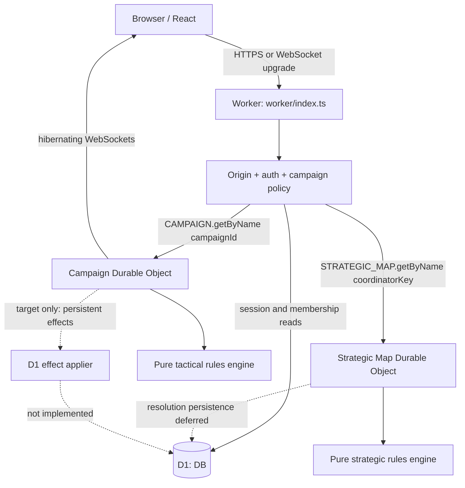

# Corinth's Plight Cloudflare Architecture

**Status:** Phase 2 production runtime plus local-only Phase 3 foundation (2026-08-10)

**Configuration:** `vite.config.ts`, `wrangler.jsonc`, and root `package.json`

**Runtime entry points:** `worker/index.ts`, `worker/campaign-durable-object.ts`, and `worker/strategic-map-durable-object.ts`

**Compatibility date:** `2026-08-08` (the current workerd-supported limit used by this repository)

## 1. Current deployment status

The repository builds a React/Vite client and one Cloudflare Worker containing the public API plus the exported Campaign and Strategic Map Durable Object classes. D1 and both named DO namespaces are configured. The V1 Flask application remains reference code and is not imported into the Worker.

The Phase 2 runtime was deployed on 2026-08-09. The primary custom domain is `https://corinthplight.qnetica.com.au`; `https://corinths-plight.cybercow-now.workers.dev` remains enabled as a fallback. Production version `dcf7463d-6176-4377-8f01-451d7e40e3e4` binds D1 database `corinths-plight-production` (`c75ca7bc-f10b-4987-853d-f387d377bdb9`). The production database has the previously released migrations and published catalogue. Migration `0004`, the strategic fixture, the `STRATEGIC_MAP` binding, and Phase 3 UI/API changes are local-only in this checkpoint and have not been deployed. Preview remains unprovisioned.

## 2. Current runtime topology



All public traffic passes through the Worker. Campaign traffic resolves D1 campaign membership before a named Campaign DO lookup. Strategic traffic resolves the caller's active Battalion, permissions, map, and stable `coordinator_key` before a named Strategic Map DO lookup. Strategic order submission is serialized by the map coordinator; development resolution remains fail-closed until its authoritative D1 journal/effect applier is implemented.

`vite.config.ts` uses React and `@cloudflare/vite-plugin`. Wrangler's `assets.not_found_handling = "single-page-application"` supplies the SPA asset behavior. There is no separately named `ASSETS` binding in the current environment type/config.

## 3. Actual repository/runtime mapping

| Path | Current Cloudflare role |
|---|---|
| `src/` | Vite-built React application |
| `worker/index.ts` | Worker fetch handler, security headers, API routing, D1 policy lookup, named-DO proxy |
| `worker/auth.ts` | Demo/session authentication, same-origin helpers, D1 campaign authorization, trusted viewer headers |
| `worker/env.ts` | Typed `DB`, `CAMPAIGN`, environment, auth, and clock bindings |
| `worker/http.ts` | JSON response/body-size/parse helpers |
| `worker/campaign-clock.ts` | Pure clock, schedule, pause, and resume transitions |
| `worker/campaign-durable-object.ts` | Exported DO class, K-17 state/orders, alarms, hibernating sockets, reports/resolution |
| `worker/strategic-map-durable-object.ts` | Exported map-sharded Phase 3 coordinator; serialized order submission and fail-closed development resolution boundary |
| `packages/domain/src/index.ts` | Shared compile-time contracts |
| `packages/rules-engine/src/` | Pure deterministic engine/catalogue/demo fixture |
| `migrations/0001_platform_and_rules.sql` | Identity, rules, source/conflict, and definition schema |
| `migrations/0002_persistent_world.sql` | Persistent forces, Battalion/ship, campaign, archive/effect schema |
| `migrations/0003_phase2_persistent_forces.sql` | Phase 2 force identity, profile, loadout, cargo, supply, status, service, and ship-capability schema |
| `migrations/0004_phase3_strategic_layer.sql` | Phase 3 identity/org evolution, locations, maps/routes, operations, Task Forces, supply, rounds, orders, events, receipts, and war variables |
| `seeds/v5-core-curated.sql` | Idempotent D1 SQL rules seed |
| `seeds/v5-phase2-combined-arms.sql` | Provenance-bearing Phase 2 combined-arms catalogue |
| `seeds/development-forces.sql` | Local-only Operation Iron Rain force fixture |
| `seeds/development-strategic-world.sql` | Local-only Helion/Corinth, CSV Resolute, Task Force, operations, and strategic supply fixture |
| `scripts/validate-seed.ts` | Source hash and runtime/SQL seed consistency checks |
| `wrangler.jsonc` | compatibility date, variables, D1/DO bindings, DO migration, environments |
| `vite.config.ts` | React and Cloudflare Vite plugins |

There is no `worker/demo.ts` or `scripts/seed-ruleset.ts`. Demo authentication is a branch in `worker/auth.ts`. The `db:seed:*` scripts separate the core and Phase 2 catalogues from the local-only force and strategic fixtures; `seed:check` validates the published catalogue and Phase 3 provenance artifacts.

## 4. Binding contract

### 4.1 Implemented bindings

| Binding/config | Current resource | Authority/status |
|---|---|---|
| `DB` | D1 | Identity/session, campaign membership, Phase 2 force/catalogue/readiness reads, and exact-once rename/developer-purchase writes are active; round-effect finalisation remains open |
| `CAMPAIGN` | Durable Object namespace | One named object per campaign; only `outpost-k17` can self-initialise in this foundation |
| `STRATEGIC_MAP` | Durable Object namespace | One named object per strategic map/theatre; order coordination is local-only and resolution persistence is deferred |
| DO migration `v1` | `new_sqlite_classes: ["CampaignDurableObject"]` | Present |
| DO migration `v2` | `new_sqlite_classes: ["StrategicMapDurableObject"]` | Local configuration present; not deployed |
| Observability | enabled, head sampling `1` | Present |
| Static assets | SPA not-found handling | Present through Wrangler/Vite integration |

There are no R2, Queue, or KV bindings. They must remain absent until an implemented feature needs them.

### 4.2 Target optional boundaries

- **R2:** authorised custom artwork, large map sources, or large immutable replay/export objects. D1 retains key, ownership, type, size, hash, and lifecycle metadata. Never active orders or sole authoritative results.
- **Queues:** notifications, analytics, exports, or integrations only after the authoritative commit. Never gate combat, D1 consequences, or next-round correctness.
- **KV:** disposable public/derived cache only. Never sessions requiring immediate revocation, ownership, requisition, campaign state, fog, rules publication, schedules, journals, or effects.

## 5. Environment matrix

The values below are the actual `wrangler.jsonc` entries:

| Wrangler selection | Worker name / environment variable | Demo auth | Round / lock lead | D1 name and current ID | Readiness |
|---|---|---:|---:|---|---|
| default (local development) | `corinths-plight` / `development` | `true` | tactical 5m / 30s; strategic 5m / 30s | `corinths-plight`, `...0001` placeholder | Local-only |
| `--env preview` | `corinths-plight-preview` / `preview` | `false` | tactical 30m / 30s; strategic 30m / 30s | `corinths-plight-preview`, `...0002` placeholder | Not provisioned/deployed |
| `--env production` | `corinths-plight` / `production` | `false` | tactical 24h / 30s; strategic 24h / 30s | `corinths-plight-production`, `c75ca7bc-f10b-4987-853d-f387d377bdb9` | Phase 2 deployed; Phase 3 not deployed |

Clock values change configuration only; manual/accelerated/production alarms call the same DO lock/resolve functions.

The default Wrangler configuration deliberately enables the local demo. It must never be used for a remote deployment. Root production scripts always set/select the production environment. Operators must use those scripts and must not bypass them with a bare `wrangler deploy`.

`ALLOW_DEMO_AUTH` is accepted only when its value is exactly `true` and `ENVIRONMENT` is exactly `development`. Production also returns 503 if configured with demo auth enabled. The explicit demo identity can access only `outpost-k17`.

## 6. Authentication and campaign-routing boundary

### 6.1 Implemented controls

- Unsafe methods and WebSocket upgrades require a present, exactly matching same-origin `Origin`.
- Explicitly cross-origin API requests are rejected, including safe requests carrying a foreign Origin or `Sec-Fetch-Site: cross-site`.
- Demo headers/query identity work only under the explicit development flag and only for K-17.
- Cookie authentication accepts a 32–512 character `corinth_session`, URI-decodes it, hashes it with SHA-256, and queries an unexpired/unrevoked session joined to an `ACTIVE` user.
- Session campaign access is loaded from D1 before `CAMPAIGN.getByName`. Only existing `ACTIVE`, `PAUSED`, `COMPLETE`, or `FAILED` campaigns route.
- `PLAYER` and `BATTALION_COMMAND` retain their campaign side; campaign `GM` maps to internal `ADMIN`; `OBSERVER`, unknown roles, and unsafe neutral projections fail closed.
- Cookies, authorization/demo inputs, query demo identity, and client-supplied internal viewer headers are stripped before the Worker adds trusted viewer headers for the DO.
- An arbitrary campaign name cannot create demo state: the DO self-initialises only when its name is exactly `outpost-k17`.
- WebSocket commands are read-only; mutations use authenticated HTTP handlers.

### 6.2 Open controls

- No production identity provider/login, passwordless flow, session issuance/rotation/logout/recovery, or account-linking workflow exists. The code can validate a pre-existing D1 session row only.
- There is no CSRF token mechanism; the current cookie-auth mitigation is strict same-origin Origin enforcement. Deployment/proxy policy must preserve the Origin signal, and a formal session/CSRF decision is required with the production provider.
- `readJson` enforces size and parses JSON but does not require JSON content type or apply general runtime schemas.
- A valid non-K-17 D1 campaign has no bootstrap/deployment-snapshot protocol; the DO fails `CAMPAIGN_NOT_INITIALISED` rather than inventing state.
- The compiled rules endpoint is separate from D1 seed rows; a campaign is not yet loaded from a D1 content hash.
- Operator commands treat any viewer as an operator outside production for development convenience; production requires `ADMIN`.

## 7. Campaign DO storage, alarms, and sockets

### 7.1 Implemented storage

```text
state/current
snapshot/{round}
resolution/{round}
event/{round}/{sequence}
pending-effect/{idempotencyKey}
```

Correctness reloads these records after eviction; in-memory values are not authority. Resolution writes current/next state, snapshot, record, events, and pending effects in a DO storage transaction.

There are no `schedule/{id}` records. Lock/resolve items are embedded in `state/current.clock.schedule` and removed/replaced as phases advance. This is sufficient for the foundation clock but not the accepted status-bearing schedule/recovery design in [ROUND_RESOLUTION.md](./ROUND_RESOLUTION.md).

### 7.2 Alarms

- One alarm is set to the earliest embedded schedule time.
- `ORDER_LOCK` and `ROUND_RESOLVE` are processed in due-time/type order with expected-round/phase checks.
- A prior `resolution/{round}` makes duplicate resolution a no-op/result replay.
- Manual mode has no alarm; manual resolve enters the same lock/resolve functions.
- Pause clears the alarm; resume shifts deadlines/schedule and restores the pre-pause planning/locked phase.

Still missing are separate consumed schedule history, explicit recovery records, PREPARED/attempt/hash states, injected crash integration tests, and the D1-effect acknowledgement gate.

### 7.3 Hibernating WebSockets

The DO uses `acceptWebSocket` and serialised viewer attachment metadata. The Worker authenticates, validates origin, and authorises campaign membership before forwarding the upgrade. Raw credentials are not forwarded or attached. Sockets accept only `ping`; campaign mutations remain HTTP-only.

Current broadcasts are sparse invalidation/status messages, which is the correct experience-layer role, but they are sent generically to all current sockets and some messages include order/unit IDs. Production target behavior must derive per-audience messages and prove those fields cannot leak hidden intentions. There is also no persisted `events-after-sequence` catch-up route; reconnect currently fetches the filtered current state/report only.

## 8. D1 operations and seed policy

### 8.1 Local foundation commands

```bash
npm install
npm run db:migrate:local
npm run db:seed:local
npm run db:seed:demo:local
npm run seed:check
npm run typecheck
npm run lint
npm test
npm run build
npm run dev
```

The SQL seed uses conflict-aware upserts and is intended to be rerunnable. However, SQL does not prevent selected fields of an already published ruleset from being updated. Release policy must treat published data as immutable, and a future content-hash/publication guard should enforce that policy.

### 8.2 Production scripts and fail-safe behavior

Actual root scripts are:

| Script | Behavior |
|---|---|
| `build:production` | Sets `CLOUDFLARE_ENV=production`, then typechecks and builds |
| `check:production-config` | Exits non-zero for an invalid production D1 ID and, for this checkpoint, unless preview verification has been completed and `CORINTH_PHASE3_RELEASE_APPROVED=true` is explicitly supplied |
| `db:migrate:remote` | Runs the guard, then applies migrations to `corinths-plight-production --remote --env production` |
| `db:seed:remote` | Runs the guard, then executes the core and Phase 2 published catalogues against production with `--env production`; it never applies either development fixture |
| `deploy:dry` | Runs guard + production build + `wrangler deploy --dry-run --env production` |
| `deploy` | Runs guard + production build + `wrangler deploy --env production` |

The production D1 resource is provisioned, but the guard intentionally remains closed for Phase 3 unless the release operator explicitly supplies `CORINTH_PHASE3_RELEASE_APPROVED=true`. The completed Phase 2 release sequence was: verify the authenticated account, create the isolated production database, apply the then-current migrations and published catalogues, run the validator/typecheck/lint/tests/production build, inspect `deploy:dry`, deploy, and perform read-only health and D1-count checks. Keep this sequence for later releases. Phase 3 requires a separate preview migration/seed/runtime verification before that approval is used for any production migration or deployment.

Preview provisioning/deployment is also not scripted at the package level. It requires a real preview D1 ID and explicit `--env preview` on every Wrangler operation. Preview must complete before production.

Do not run `db.create_all()`, `drop_all()`, manual dashboard schema edits, or legacy Alembic against D1.

## 9. Current versus target D1 consequence flow

Current behavior:

```text
DO resolver -> pending-effect/{id} in DO
            -> next round opens immediately
            X no D1 applier/archive write
```

Target behavior:

```text
DO result commit -> pending stable effect + payload hash
                 -> idempotent D1 transactional applier
                 -> matching APPLIED acknowledgement
                 -> DO finalises report/next round once
```

The landed `persistent_effects` table alone does not implement this flow. There is no Worker/DO applier, no payload hash collision check, no archive application, and no acknowledgement back to the DO. See [DATA_MODEL.md](./DATA_MODEL.md) and [ROUND_RESOLUTION.md](./ROUND_RESOLUTION.md).

## 10. Security and projection status

Implemented:

- strict origin policy for mutations/upgrades and no open CORS path;
- active session and campaign-scoped D1 authorization before DO lookup;
- explicit fail-closed role mapping and local-only demo campaign;
- credential/internal-header stripping at the Worker/DO boundary;
- server-derived owner/rules/action/target validation;
- HTTP security headers and no-store JSON responses;
- server-side battlefield projection, report projection, hidden drafts, and removal of stored seed/effects/journal fields.

Still required:

- production identity/session lifecycle and managed provider secrets;
- runtime request/response schemas and content-type policy;
- server-secret seed/HMAC or equivalent commitment protocol;
- cryptographic input/output/effect hashes;
- event-time field-level report/replay projection and per-audience socket projection;
- admin audit/idempotency and rate limits;
- authorised R2 upload controls if/when uploads are introduced.

## 11. Observability and recovery

Wrangler observability is enabled. Current Worker logs contain request ID, method, path, status, and duration; DO logs include campaign ID plus operation-specific fields. They do not yet provide the target resolution attempt, input/output hash, effect acknowledgement, schedule history, or reconciliation views because those records do not exist.

Never log session cookies/tokens, V1 passwords, seed secrets, canonical hidden state, or unprojected event payloads. Target operator tooling must inspect campaign phase/round/journal/schedule, pending D1 effects, migrations/ruleset pin, and safe retry/compensation state without editing combat results ad hoc.

## 12. Deployment-readiness checklist

Legend: `[x]` complete, `[~]` partial/local only, `[ ]` open.

- [x] `vite.config.ts` uses React and the Cloudflare Vite plugin.
- [x] `wrangler.jsonc` uses compatibility date `2026-08-08`.
- [x] `CampaignDurableObject` is exported, bound as `CAMPAIGN`, and included in DO migration `v1`.
- [~] `StrategicMapDurableObject` is locally exported, bound as `STRATEGIC_MAP`, and included in DO migration `v2`; it is not deployed and strategic resolution persistence remains blocked.
- [x] No R2, Queue, or KV authority binding is present.
- [x] Demo auth requires exact development opt-in and is limited to `outpost-k17`; production cannot enable it safely.
- [x] Unsafe mutations/WebSocket upgrades require same origin; D1 membership is checked before DO lookup.
- [x] Four additive D1 migrations, published/local seed separation, source-hash validator, TypeScript build, lint, and unit tests exist.
- [~] Manual/accelerated/24h clocks and pause/resume are unit-tested; alarm crash/eviction integration is not.
- [~] Snapshot/report projection exists; event-time payload and socket-audience leakage coverage is incomplete.
- [ ] Implement production login/provider and session issuance/recovery/rotation/revocation flow.
- [ ] Implement non-K-17 campaign bootstrap from D1-authorised deployment data.
- [ ] Implement PREPARED journal, cryptographic input/output hashes, and protected deterministic seed.
- [ ] Implement separate persisted schedule records and consumed/recovery semantics.
- [ ] Implement the D1 persistent-effect/archive applier and acknowledgement-gated next round.
- [ ] Implement events-after-sequence reconnect and hibernation integration tests.
- [ ] Provision the preview D1 resource and replace its placeholder ID; production D1 is already provisioned.
- [ ] Complete and record a remote preview deployment/smoke test.
- [ ] Complete and record the production remote migration/seed/deployment.

## 13. Cloudflare decisions

### ADR-C01: One Worker plus one named DO per campaign

**Status:** Implemented for K-17; general campaign bootstrap open.

**Trade-off:** Active campaign scale is bounded by one DO, while Worker/client share a release.

**Revisit:** Only after measured per-campaign or independent-release pressure.

### ADR-C02: D1 for global relational truth

**Status:** Schema and auth reads implemented; domain services/effect application incomplete.

**Trade-off:** D1/DO cannot share a transaction, requiring the explicit effect journal.

**Revisit:** Partition only for measured scale, residency, or blast-radius constraints.

### ADR-C03: Hibernating WebSockets as an experience layer

**Status:** Foundation socket implemented; projection/catch-up incomplete.

**Trade-off:** Clients must tolerate missed messages and refetch authoritative projections.

**Revisit:** If measured campaign connection/message load exceeds a DO's practical capacity.

### ADR-C04: Persisted logical schedule with one DO alarm

**Status:** Accepted target; current schedule is embedded in `state/current`.

**Trade-off:** Separate status records add recovery code but make retry/consumption auditable.

**Revisit:** Keep the one-alarm model unless a non-campaign strategic scheduler becomes a separately justified aggregate.

### ADR-C05: R2, Queues, and KV remain optional

**Status:** Implemented by absence.

**Trade-off:** Upload/export/notification/cache features remain deferred.

**Revisit:** Add a binding only with an implemented feature, authorization/lifecycle plan, and idempotency/cost tests.

Related boundaries: [ARCHITECTURE.md](./ARCHITECTURE.md), [DATA_MODEL.md](./DATA_MODEL.md), and [ROUND_RESOLUTION.md](./ROUND_RESOLUTION.md).
