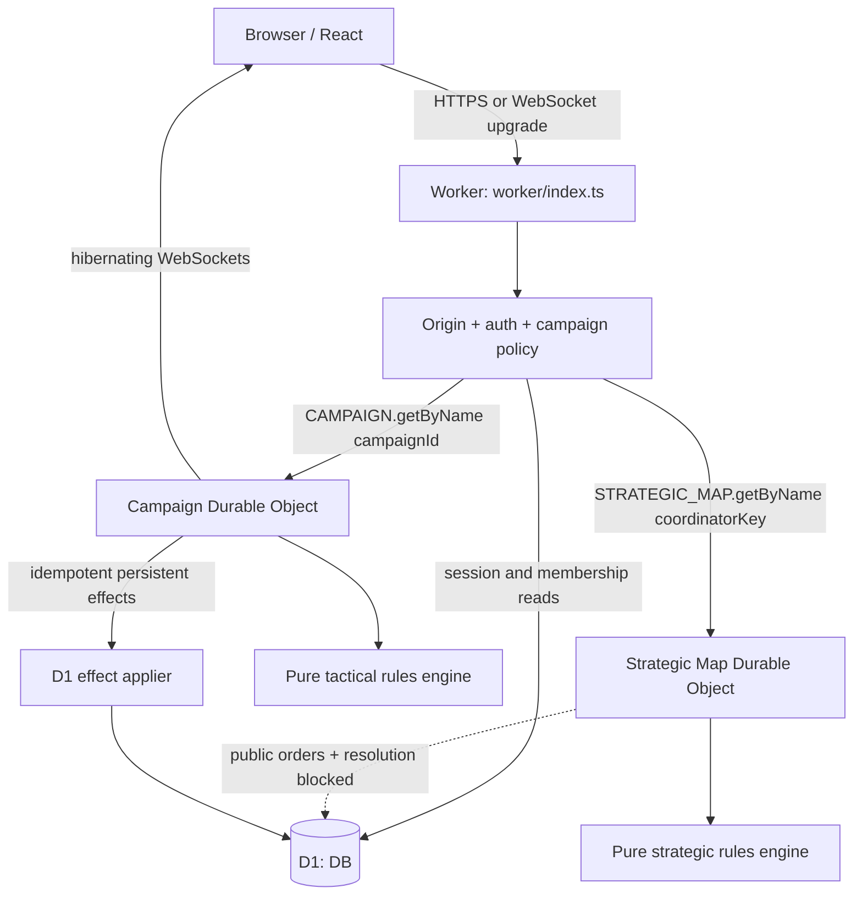

# Corinth's Plight Cloudflare Architecture

**Status:** Phase 3, equipment/deployment, production identity, and guided-enlistment runtime (2026-08-10)

**Configuration:** `vite.config.ts`, `wrangler.jsonc`, and root `package.json`

**Runtime entry points:** `worker/index.ts`, `worker/campaign-durable-object.ts`, and `worker/strategic-map-durable-object.ts`

**Compatibility date:** `2026-08-08` (the current workerd-supported limit used by this repository)

## 1. Current deployment status

The repository builds a React/Vite client and one Cloudflare Worker containing the public API plus the exported Campaign and Strategic Map Durable Object classes. D1 and both named DO namespaces are configured. The V1 Flask application remains reference code and is not imported into the Worker.

The Phase 3, equipment/deployment, passwordless identity, and guided-enlistment runtime was deployed on 2026-08-10. The primary custom domain is `https://corinthplight.qnetica.com.au`; `https://corinths-plight.cybercow-now.workers.dev` remains enabled as a fallback. Production version `f34fa674-b242-4bda-9a7d-dd06cddc7363` binds D1 database `corinths-plight-production` (`c75ca7bc-f10b-4987-853d-f387d377bdb9`) and both Durable Object namespaces. Production is migrated through `0007` and contains the four production-approved seed families, verified-email challenge/session support, the onboarding economy policy, and three NPC recruitment Battalions. The catalogue/conflict split documented in [GAME_SYSTEMS.md](./GAME_SYSTEMS.md) remains a release blocker. Development fixtures were deliberately not applied; preview remains unprovisioned.

The current repository additionally contains migration `0008_auth_retention_and_invitation_abuse.sql`, an hourly `0 * * * *` Worker schedule, bounded retention maintenance, and invitation throttling/audit. Those changes are locally verified only. They are not present in the recorded production version and must not be described as active on the public origin until `0008` is migrated and a new Worker version is explicitly deployed.

## 2. Current runtime topology



All public traffic passes through the Worker. Campaign traffic resolves D1 campaign membership before a named Campaign DO lookup. Strategic reads resolve the caller's active Battalion, permissions, map, and stable `coordinator_key`. The Strategic Map DO contains an internal order handler, but the public `POST /api/strategic/orders` route never forwards to it and returns `501 STRATEGIC_ORDER_EXECUTION_DEFERRED`; the DO's development resolver returns `501 STRATEGIC_RESOLUTION_NOT_IMPLEMENTED`. The named coordinator boundary is deployed, but public strategic execution is not.

`vite.config.ts` uses React and `@cloudflare/vite-plugin`. Wrangler's `assets.not_found_handling = "single-page-application"` supplies the SPA asset behavior, while `assets.run_worker_first = ["/api/*"]` prevents navigation requests such as email verification from being swallowed by the SPA fallback. There is no separately named `ASSETS` binding in the current environment type/config.

## 3. Actual repository/runtime mapping

| Path | Current Cloudflare role |
|---|---|
| `src/` | Vite-built React application |
| `worker/index.ts` | Worker fetch handler, security headers, API routing, D1 policy lookup, named-DO proxy |
| `worker/auth.ts` | Demo/session authentication, same-origin helpers, D1 campaign authorization, trusted viewer headers |
| `worker/routes/auth.ts`, `worker/services/auth.ts` | Passwordless registration/login/session/logout boundary and Resend delivery adapter |
| `worker/routes/onboarding.ts`, `worker/services/onboarding.ts` | Guided enlistment, Battalion recruitment/invitations, charter economy, and starter-unit grant |
| `worker/services/security-operations.ts`, `worker/repositories/security-operations.ts`, `worker/services/invitation-delivery.ts` | Immediate/background Resend outbox, hourly recovery/retention, four-scope invitation throttling and pseudonymized audit; local-only pending `0008` deployment |
| `worker/env.ts` | Typed `DB`, `CAMPAIGN`, environment, auth, and clock bindings |
| `worker/http.ts` | JSON response/body-size/parse helpers |
| `worker/campaign-clock.ts` | Pure clock, schedule, pause, and resume transitions |
| `worker/campaign-durable-object.ts` | Exported DO class, K-17 state/orders, alarms, hibernating sockets, reports/resolution |
| `worker/strategic-map-durable-object.ts` | Exported map-sharded Phase 3 coordinator shell; internal order handler exists, but public order submission is blocked and development resolution returns `501` |
| `packages/domain/src/index.ts` | Shared compile-time contracts |
| `packages/rules-engine/src/` | Pure deterministic engine/catalogue/demo fixture |
| `migrations/0001_platform_and_rules.sql` | Identity, rules, source/conflict, and definition schema |
| `migrations/0002_persistent_world.sql` | Persistent forces, Battalion/ship, campaign, archive/effect schema |
| `migrations/0003_phase2_persistent_forces.sql` | Phase 2 force identity, profile, loadout, cargo, supply, status, service, and ship-capability schema |
| `migrations/0004_phase3_strategic_layer.sql` | Phase 3 identity/org evolution, locations, maps/routes, operations, Task Forces, supply, rounds, orders, events, receipts, and war variables |
| `migrations/0005_equipment_deployment_vertical_slice.sql` | Equipment effects/refits, owner inventory, loadout locks, deployment plans/transports/snapshots, campaign resource state, and effect receipts |
| `migrations/0006_production_identity.sql` | Verified-email challenges, session activity, HMAC-keyed rate limits, and auth audit events |
| `migrations/0007_guided_onboarding_and_battalions.sql` | Guided progress/receipts, Battalion recruitment/charters/email invites, and starter grants |
| `migrations/0008_auth_retention_and_invitation_abuse.sql` | Indexed bounded retention paths, pseudonymized invitation rate buckets/audit, and leased delivery jobs; present locally, not applied to recorded production |
| `seeds/v5-core-curated.sql` | Idempotent D1 SQL rules seed |
| `seeds/v5-phase2-combined-arms.sql` | Provenance-bearing Phase 2 combined-arms catalogue |
| `seeds/v5-equipment-deployment.sql` | Equipment/action/deployment-method overlays for the narrow vertical slice; presence or `executable` flags do not override the open slot/Scan/Drone rule gates |
| `seeds/onboarding-foundation.sql` | Production-safe onboarding economy policy and three system recruitment Battalions |
| `seeds/development-forces.sql` | Local-only Operation Iron Rain force fixture |
| `seeds/development-strategic-world.sql` | Local-only Helion/Corinth, CSV Resolute, Task Force, operations, and strategic supply fixture |
| `seeds/development-spearhead.sql` | Local-only Operation Spearhead loadout/deployment fixture |
| `scripts/validate-seed.ts` | Source hash and runtime/SQL seed consistency checks |
| `wrangler.jsonc` | compatibility date, variables, D1/DO bindings, DO migration, environments |
| `vite.config.ts` | React and Cloudflare Vite plugins |

There is no `worker/demo.ts` or `scripts/seed-ruleset.ts`. Demo authentication is a branch in `worker/auth.ts`. The `db:seed:*` scripts separate the core and Phase 2 catalogues from the local-only force and strategic fixtures; `seed:check` validates the published catalogue and Phase 3 provenance artifacts.

## 4. Binding contract

### 4.1 Implemented bindings

| Binding/config | Current resource | Authority/status |
|---|---|---|
| `DB` | D1 | Identity/session/onboarding, Battalion recruitment, force/equipment/loadout/deployment services, campaign authorization, strategic read models, and narrow campaign-effect receipts are active; broader economy/world workflows and release-grade round finalisation remain open |
| `CAMPAIGN` | Durable Object namespace | One named object per campaign; K-17 self-initialises, while other authorised campaigns require committed D1 deployment snapshots but still inherit the K-17 demo map/terrain scaffold |
| `STRATEGIC_MAP` | Durable Object namespace | Deployed named-object boundary per strategic map/theatre; internal order service shell exists, but public order submission and resolution are blocked |
| DO migration `v1` | `new_sqlite_classes: ["CampaignDurableObject"]` | Present |
| DO migration `v2` | `new_sqlite_classes: ["StrategicMapDurableObject"]` | Present in the recorded production deployment; namespace existence is not evidence of strategic execution |
| Observability | enabled, head sampling `1` | Present |
| Scheduled trigger | `0 * * * *` in default/preview/production configuration | Local configuration for `0008` retention/expiry; not active in the recorded production version |
| Static assets | SPA not-found handling | Present through Wrangler/Vite integration |

There are no R2, Queue, or KV bindings. They must remain absent until an implemented feature needs them.

### 4.2 Target optional boundaries

- **R2:** authorised custom artwork, large map sources, or large immutable replay/export objects. D1 retains key, ownership, type, size, hash, and lifecycle metadata. Never active orders or sole authoritative results.
- **Queues:** notifications, analytics, exports, or integrations only after the authoritative commit. Never gate combat, D1 consequences, or next-round correctness.
- **KV:** disposable public/derived cache only. Never sessions requiring immediate revocation, ownership, requisition, campaign state, fog, rules publication, schedules, journals, or effects.

## 5. Environment matrix

The values below are the actual `wrangler.jsonc` entries:

| Wrangler selection | Worker name / environment variable | Demo auth | Round / lock lead | D1 name and current ID | Readiness |
|---|---|---:|---:|---|---|
| default (local development) | `corinths-plight` / `development` | `true` | tactical 5m / 30s; strategic 5m / 30s | `corinths-plight`, `...0001` placeholder | Local-only |
| `--env preview` | `corinths-plight-preview` / `preview` | `false` | tactical 30m / 30s; strategic 30m / 30s | `corinths-plight-preview`, `...0002` placeholder | Not provisioned/deployed |
| `--env production` | `corinths-plight` / `production` | `false` | tactical 24h / 30s; strategic 24h / 30s | `corinths-plight-production`, `c75ca7bc-f10b-4987-853d-f387d377bdb9` | Phase 3/equipment/passwordless identity runtime deployed; scenario data absent |

Clock values change configuration only; manual/accelerated/production alarms call the same DO lock/resolve functions.

The default Wrangler configuration deliberately enables the local demo. It must never be used for a remote deployment. Root production scripts always set/select the production environment. Operators must use those scripts and must not bypass them with a bare `wrangler deploy`.

`ALLOW_DEMO_AUTH` is accepted only when its value is exactly `true` and `ENVIRONMENT` is exactly `development`. Production also returns 503 if configured with demo auth enabled. Demo campaign access still requires a seeded D1 campaign and membership; current local content includes K-17, Iron Rain, and Spearhead records, while only K-17 and Iron Rain have authored tactical loaders.

## 6. Authentication and campaign-routing boundary

### 6.1 Implemented controls

- Unsafe methods and WebSocket upgrades require a present, exactly matching same-origin `Origin`.
- Explicitly cross-origin API requests are rejected. The sole exception is an Origin-less top-level document navigation to exact `GET /api/auth/verify`, allowing links opened from mail clients to stage their token without mutating account state; its confirmation POST remains exact same-origin.
- Demo headers/query identity work only under the explicit development flag; campaign routes still require an existing D1 membership.
- Cookie authentication accepts a 32–512 character `corinth_session`, URI-decodes it, hashes it with SHA-256, and queries an unexpired/unrevoked session joined to an `ACTIVE` user.
- Session campaign access is loaded from D1 before `CAMPAIGN.getByName`. Only existing `ACTIVE`, `PAUSED`, `COMPLETE`, or `FAILED` campaigns route.
- `PLAYER` and `BATTALION_COMMAND` retain their campaign side; campaign `GM` maps to internal `ADMIN`; `OBSERVER`, unknown roles, and unsafe neutral projections fail closed.
- Cookies, authorization/demo inputs, query demo identity, and client-supplied internal viewer headers are stripped before the Worker adds trusted viewer headers for the DO.
- An arbitrary campaign name cannot create demo state: the DO self-initialises only when its name is exactly `outpost-k17`.
- WebSocket commands are read-only; mutations use authenticated HTTP handlers.
- The passwordless Resend flow, opaque session issuance, current-session projection, logout, and guided onboarding are deployed through migrations `0006` and `0007`. See [AUTHENTICATION.md](./AUTHENTICATION.md) and [ONBOARDING.md](./ONBOARDING.md).
- Migration `0008` adds bounded hourly retention and four-scope invitation abuse controls locally; it is not active on production until a separately authorized migration and deploy.

### 6.2 Partial and open controls

- There is no separate synchronizer-token mechanism; the current cookie-auth mitigation is exact same-origin Origin enforcement plus `SameSite=Lax`. Deployment/proxy policy must preserve the Origin signal.
- `readJson` enforces size and parses JSON but does not require JSON content type or apply general runtime schemas.
- Campaign order/clock payloads have dedicated bounded parsers; bodyless tactical mutations reject payloads; and `state/current`/new snapshots use a validated versioned envelope. Critical nested map/deployment/weapon/order/clock/effect shapes are checked, but this remains a tactical contract rather than general public DTO coverage.
- A non-K-17 campaign requires authorised D1 deployment snapshots, but its runtime still calls the K-17 demo-state factory, retains that map/terrain shape, clears objectives, and uses fallback positions. General scenario bootstrap remains open.
- The compiled rules endpoint is separate from D1 seed rows; a campaign is not yet loaded from a D1 content hash.
- Operator commands treat any viewer as an operator outside production for development convenience; production requires `ADMIN`.

## 7. Campaign DO storage, alarms, and sockets

### 7.1 Implemented storage

```text
state/current
snapshot/{round}
resolution/{round}
event/{round}/{sequence}
pending-effect/{idempotencyKey}
command/order/{encodedUserId}/{encodedCommandId}
command/clock/{encodedUserId}/{encodedCommandId}
```

Correctness reloads these records after eviction; in-memory values are not authority. `state/current` is stored as a schema-version-1 envelope and a legacy raw state is validated then rewritten on read. New `snapshot/{round}` writes use the same versioned envelope. Order upsert and clock update atomically store state plus actor/command/request-hash/response receipts (and the order event where applicable); exact retries replay and changed-payload reuse conflicts. Resolution writes current/next state, snapshot, record, events, and pending effects in a DO storage transaction.

There are no `schedule/{id}` records. Lock/resolve items are embedded in `state/current.clock.schedule` and removed/replaced as phases advance. This is sufficient for the foundation clock but not the accepted status-bearing schedule/recovery design in [ROUND_RESOLUTION.md](./ROUND_RESOLUTION.md).

### 7.2 Alarms

- One alarm is set to the earliest embedded schedule time.
- `ORDER_LOCK` and `ROUND_RESOLVE` are processed in due-time/type order with expected-round/phase checks.
- A prior `resolution/{round}` makes duplicate resolution a no-op/result replay.
- Manual mode has no alarm; manual resolve enters the same lock/resolve functions.
- Pause clears the alarm; resume shifts deadlines/schedule and restores the pre-pause planning/locked phase.

Still missing are separate consumed schedule history, explicit recovery records, PREPARED/attempt/hash states, injected crash integration tests, and the D1-effect acknowledgement gate.

### 7.3 Hibernating WebSockets

The DO uses `acceptWebSocket` and serialised viewer attachment metadata. The Worker authenticates, validates origin, and authorises campaign membership before forwarding the upgrade. Raw credentials are not forwarded or attached. Sockets accept only `ping`; campaign mutations remain HTTP-only.

Broadcasts are sparse experience-layer invalidations. The DO deserializes the authenticated viewer attachment for each socket and sends only campaign/round/phase/deadline/version plus that viewer's projected event cursor; order IDs, unit IDs, resolution keys and digests are not socket fields. Reconnect supplies `sinceRound`, `sinceSequence`, and `sinceVersion`; the initial socket message includes up to 100 missed events after that cursor, filtered through the same audience projection, and directs the client to refetch authoritative state. This catch-up is bounded from current DO event state rather than a separate unbounded feed. Event-time historical intelligence and hibernation/browser integration evidence remain open.

## 8. D1 operations and seed policy

### 8.1 Local foundation commands

```bash
npm install
npm run db:migrate:local
npm run db:seed:local
npm run db:seed:demo:local
npm run seed:check
npm run typecheck
npm run lint
npm test
npm run build
npm run dev
```

The SQL seed uses conflict-aware upserts and is intended to be rerunnable. However, SQL does not prevent selected fields of an already published ruleset from being updated. Release policy must treat published data as immutable, and a future content-hash/publication guard should enforce that policy.

### 8.2 Production scripts and fail-safe behavior

Actual root scripts are:

| Script | Behavior |
|---|---|
| `build:production` | Sets `CLOUDFLARE_ENV=production`, then typechecks and builds |
| `check:production-config` | Exits non-zero for an invalid production D1 ID or unless `CORINTH_RELEASE_APPROVED=true` is explicitly supplied |
| `db:migrate:remote` | Runs the guard, then applies migrations to `corinths-plight-production --remote --env production` |
| `db:seed:remote` | Runs the guard, then executes the core, Phase 2, equipment/deployment, and production-safe onboarding seeds against production with `--env production`; it never applies a development fixture |
| `deploy:dry` | Runs guard + production build + `wrangler deploy --dry-run --env production` |
| `deploy` | Runs guard + production build + `wrangler deploy --env production` |

The production D1 resource is provisioned, but the guard remains closed unless the release operator explicitly supplies `CORINTH_RELEASE_APPROVED=true`. Release sequence: verify the authenticated account, export D1, rehearse all migrations/seeds in an isolated local database, run validator/typecheck/lint/tests/production build, inspect `deploy:dry`, apply remote migrations and canonical seeds, deploy, and perform read-only health and D1 checks.

Preview provisioning/deployment is also not scripted at the package level. It requires a real preview D1 ID and explicit `--env preview` on every Wrangler operation. Preview must complete before production.

Do not run `db.create_all()`, `drop_all()`, manual dashboard schema edits, or legacy Alembic against D1.

## 9. Current versus target D1 consequence flow

Current behavior:

```text
DO resolver -> pending-effect/{id} in DO
            -> idempotent D1 batch + campaign_effect_receipts
            -> pending record deleted after receipt verification
            -> next round is already open (acknowledgement gate still missing)
```

Target behavior:

```text
DO result commit -> pending stable effect + payload hash
                 -> idempotent D1 transactional applier
                 -> matching APPLIED acknowledgement
                 -> DO finalises report/next round once
```

The landed `persistent_effects` table alone does not implement this flow. The Campaign DO does contain a narrow receipt-idempotent D1 applier for supported effects, but it has no cryptographic payload-hash collision journal, archive application, acknowledgement-gated next-round transition, or operator-safe reconciliation loop. See [DATA_MODEL.md](./DATA_MODEL.md) and [ROUND_RESOLUTION.md](./ROUND_RESOLUTION.md).

## 10. Security and projection status

Implemented:

- strict origin policy for mutations/upgrades and no open CORS path;
- active session and campaign-scoped D1 authorization before DO lookup;
- explicit fail-closed role mapping and local-only demo campaign;
- credential/internal-header stripping at the Worker/DO boundary;
- server-derived owner/rules/action/target validation;
- HTTP security headers and no-store JSON responses;
- server-side battlefield projection, report projection, hidden drafts, and removal of stored seed/effects/journal fields.

Still required:

- deploy and monitor the local `0008` retention/expiry implementation, and reconcile its operational defaults with the pending privacy/legal policy;
- runtime request/response schemas and content-type policy;
- server-secret seed/HMAC or equivalent commitment protocol;
- cryptographic input/output/effect hashes;
- event-time field-level report/replay projection and per-audience socket projection;
- admin audit/idempotency and rate limits;
- authorised R2 upload controls if/when uploads are introduced.

## 11. Observability and recovery

Wrangler observability is enabled. Current Worker logs contain request ID, method, path, status, and duration; DO logs include campaign ID plus operation-specific fields. They do not yet provide the target resolution attempt, input/output hash, effect acknowledgement, schedule history, or reconciliation views because those records do not exist.

The local `0008` scheduled handler logs its cron timestamp and aggregate table-change counts only. It must not log invitation recipients, IP addresses, hashes, tokens, or row payloads. No production scheduled-run evidence exists yet.

Never log session cookies/tokens, V1 passwords, seed secrets, canonical hidden state, or unprojected event payloads. Target operator tooling must inspect campaign phase/round/journal/schedule, pending D1 effects, migrations/ruleset pin, and safe retry/compensation state without editing combat results ad hoc.

## 12. Deployment-readiness checklist

Legend: `[x]` complete, `[~]` partial/local only, `[ ]` open.

- [x] `vite.config.ts` uses React and the Cloudflare Vite plugin.
- [x] `wrangler.jsonc` uses compatibility date `2026-08-08`.
- [x] `CampaignDurableObject` is exported, bound as `CAMPAIGN`, and included in DO migration `v1`.
- [~] `StrategicMapDurableObject` is exported, deployed, bound as `STRATEGIC_MAP`, and included in DO migration `v2`; strategic resolution persistence remains blocked.
- [x] No R2, Queue, or KV authority binding is present.
- [x] Demo auth requires exact development opt-in and is limited to `outpost-k17` and `operation-spearhead`; production cannot enable it safely.
- [x] Unsafe mutations/WebSocket upgrades require same origin; D1 membership is checked before DO lookup.
- [~] Eight additive D1 migrations pass a fresh empty replay locally; all seven seeds pass twice with integrity/FK checks. Production is recorded only through `0007`, and `0008` awaits explicit migration/deployment authorization.
- [~] A four-test local Playwright smoke baseline covers public auth, authenticated live navigation without showcase fallback, tactical rejection of forged action economy, and 390px overflow; CI is configured, but no remote run, full browser matrix, accessibility, or performance evidence exists yet.
- [~] Guided enlistment and Battalion public/private/code/invitation recruitment are deployed with actor-scoped receipts, expected revisions, permission checks, and Resend delivery; `0008` invitation throttling/expiry is locally verified but not deployed.
- [~] Manual/accelerated/24h clocks and pause/resume are unit-tested; alarm crash/eviction integration is not.
- [~] Snapshot/report projection exists; event-time payload and socket-audience leakage coverage is incomplete.
- [x] Implement and deploy passwordless production registration/login, opaque session issuance, email-based recovery, and logout revocation.
- [~] Load non-K-17 forces from committed D1 deployment snapshots; replace the inherited K-17 map/terrain scaffold with authoritative scenario content and validation.
- [ ] Implement PREPARED journal, cryptographic input/output hashes, and protected deterministic seed.
- [ ] Implement separate persisted schedule records and consumed/recovery semantics.
- [~] D1 persistent-effect application uses idempotent receipts; acknowledgement-gated next-round transition and a cryptographic payload journal remain open.
- [x] Implement bounded audience-projected events-after-sequence reconnect.
- [ ] Add hibernation/browser reconnect integration evidence and event-time intelligence projection.
- [ ] Provision the preview D1 resource and replace its placeholder ID; production D1 is already provisioned.
- [ ] Complete and record a remote preview deployment/smoke test.
- [x] Complete and record production migration/deployment through `0007`, version `f34fa674-b242-4bda-9a7d-dd06cddc7363`.

## 13. Cloudflare decisions

### ADR-C01: One Worker plus one named DO per campaign

**Status:** Implemented for K-17; committed-snapshot force loading is partial and scenario bootstrap is still fixture-derived.

**Trade-off:** Active campaign scale is bounded by one DO, while Worker/client share a release.

**Revisit:** Only after measured per-campaign or independent-release pressure.

### ADR-C02: D1 for global relational truth

**Status:** Schema, auth, force/loadout/deployment services, and the narrow campaign-effect application path are implemented; full cross-store journal/gating remains incomplete.

**Trade-off:** D1/DO cannot share a transaction, requiring the explicit effect journal.

**Revisit:** Partition only for measured scale, residency, or blast-radius constraints.

### ADR-C03: Hibernating WebSockets as an experience layer

**Status:** Foundation socket implemented; projection/catch-up incomplete.

**Trade-off:** Clients must tolerate missed messages and refetch authoritative projections.

**Revisit:** If measured campaign connection/message load exceeds a DO's practical capacity.

### ADR-C04: Persisted logical schedule with one DO alarm

**Status:** Accepted target; current schedule is embedded in `state/current`.

**Trade-off:** Separate status records add recovery code but make retry/consumption auditable.

**Revisit:** Keep the one-alarm model unless a non-campaign strategic scheduler becomes a separately justified aggregate.

### ADR-C05: R2, Queues, and KV remain optional

**Status:** Implemented by absence.

**Trade-off:** Upload/export/notification/cache features remain deferred.

**Revisit:** Add a binding only with an implemented feature, authorization/lifecycle plan, and idempotency/cost tests.

Related boundaries: [ARCHITECTURE.md](./ARCHITECTURE.md), [DATA_MODEL.md](./DATA_MODEL.md), and [ROUND_RESOLUTION.md](./ROUND_RESOLUTION.md).

## 14. Current migration and seed order

The repository migration head is `0008_auth_retention_and_invitation_abuse.sql`; the recorded production head remains `0007_guided_onboarding_and_battalions.sql`. The production-approved seed chain is core, Phase 2 combined arms, equipment/deployment, then onboarding foundation. `development-forces.sql`, `development-strategic-world.sql`, and `development-spearhead.sql` are local-only and must never be applied to production.

Production release order is:

1. export/backup the production D1 database;
2. run a production Worker dry build;
3. apply pending D1 migrations in order through the reviewed repository head (currently `0008`) before deploying code that depends on them;
4. apply the four production-approved seed families in order; never apply a development fixture;
5. deploy the Worker/client with the Phase 3 Strategic Map DO export;
6. smoke-test health, anonymous authentication boundaries, the custom domain, and migration state.

The release guard requires `CORINTH_RELEASE_APPROVED=true`; production demo auth remains false. This sequence is an operational outline, not authorization to change Cloudflare. Preview remains unprovisioned and must prove the production-like release path before another production release. Operation Spearhead and all development identities/fixtures remain local-only.
