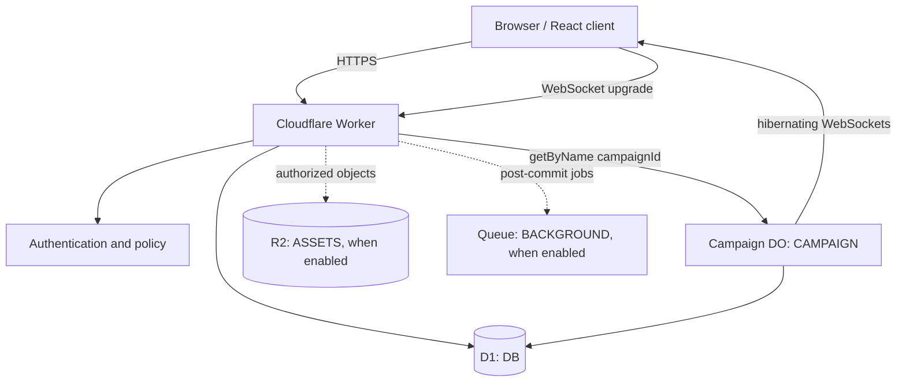

# Corinth's Plight Cloudflare Architecture

**Status:** Foundation deployment contract  
**Configuration:** root `vite.config.ts` and `wrangler.jsonc`  
**Runtime entry points:** `worker/index.ts` and `worker/campaign-durable-object.ts`

## 1. Deployment outcome

The first milestone deploys one Cloudflare Worker application containing:

- the React/Vite client from `src/`;
- HTTP/WebSocket routing from `worker/index.ts`;
- one exported `CampaignDurableObject` class, with one named instance per active campaign;
- D1 bindings for global persistent data;
- shared Worker-safe domain and rules-engine packages.

The V1 Flask application remains in the repository as migration/reference code. It is not bundled into the Worker and is not a second production backend.

The [Cloudflare Vite plugin](https://developers.cloudflare.com/workers/vite-plugin/) runs Worker code in the Workers runtime during development, builds frontend assets, and reads root Wrangler configuration. `vite.config.ts` should use `@cloudflare/vite-plugin`; its configuration resolves root `wrangler.jsonc` by default according to the [plugin API](https://developers.cloudflare.com/workers/vite-plugin/reference/api/).

## 2. Runtime topology



All browser traffic enters through the Worker. The Worker validates the URL campaign ID, constructs a trusted principal, performs global authorization, and routes campaign-local commands to `env.CAMPAIGN.getByName(campaignId)`. No endpoint routes all campaigns to one global object.

## 3. Repository/runtime mapping

| Path | Cloudflare role |
|---|---|
| `src/` | Vite-built browser application and static assets |
| `worker/index.ts` | Worker fetch handler/composition root, `/api/*` routing, WebSocket proxy and asset fallback |
| `worker/auth.ts` | Production auth adapter and policy boundary |
| `worker/demo.ts` | Explicit local/development identity and scenario fixtures only |
| `worker/campaign-durable-object.ts` | Exported DO class, alarms, sockets, active storage and resolution protocol |
| `packages/domain/src/` | Worker/client-safe contracts and validation schemas |
| `packages/rules-engine/src/` | Pure deterministic engine imported by Worker/DO |
| `migrations/` | Ordered D1 SQL migrations |
| `seeds/` | Versioned rule/map/demo input data |
| `scripts/seed-ruleset.ts` | Idempotent rules seed importer |
| `wrangler.jsonc` | Bindings, DO migration/class export, compatibility date and environment configuration |
| `vite.config.ts` | React/Vite and Cloudflare plugin composition |

The Worker runtime must not import Python, Flask, filesystem-dependent V1 modules, or Node-only libraries unsupported by Workers.

## 4. Binding contract

The canonical bindings are:

| Binding | Resource | Required in foundation | Authority |
|---|---|---:|---|
| `DB` | D1 database | Yes | global relational state, rules catalogue, ownership, ledger, memberships, campaign registry, archives/effects |
| `CAMPAIGN` | Durable Object namespace | Yes | active mutable state for one campaign per named instance |
| `ASSETS` | R2 bucket | No; add with first genuine object-storage feature | uploads, large immutable maps/snapshots/replay exports only |
| `BACKGROUND` | Queue producer/consumer | No; add with first asynchronous secondary job | notifications, analytics, archival/export/integration work after authority commits |

There is deliberately no foundation KV binding. Workers KV is eventually consistent and is not appropriate for atomic read/write authority; Cloudflare documents that cached values may remain stale and recommends Durable Objects where stronger consistency is needed ([KV consistency guidance](https://developers.cloudflare.com/kv/concepts/how-kv-works/)). If KV is introduced later, it is a disposable cache whose misses and stale entries never change game truth.

`wrangler.jsonc` contains resource names/IDs and non-secret configuration. Authentication secrets, seed-HMAC keys and provider credentials use managed secrets, never committed literals. This explicitly replaces V1's committed/overridden secret strings.

## 5. D1 responsibilities and access

D1 owns the tables in [DATA_MODEL.md](./DATA_MODEL.md): identity/session/profile data, immutable rules catalogue, Player Units/equipment/history, requisition transactions, Battalion/rank/membership/battlegroup data, ships/cargo, planets/campaign registry/membership/deployments, and round/order/event/effects archives.

Rules:

- Use prepared statements and typed row adapters in Worker code.
- Enable/verify foreign-key behavior required by migrations and enforce all unique/partial indexes in SQL.
- Mutations that uphold one invariant execute as one bounded D1 transaction/batch. Cloudflare documents `D1Database.batch()` as transactional and rolling back the sequence on failure ([D1 Worker API](https://developers.cloudflare.com/d1/worker-api/d1-database/)).
- Use stable request/effect idempotency keys, not read-then-write assumptions across independent requests.
- Do not manually edit production schema. Apply ordered migration files.
- Do not delete or replace a published ruleset. Seed a new version and content hash.
- Do not poll D1 at high frequency for live campaign changes; the campaign DO owns those changes.
- Read-replication/session features, if enabled later, must not weaken read-after-write checks used for purchases, deployment or effect application.

The foundation uses one D1 database per environment. Split databases only after measured size, blast-radius, regulatory or operational requirements justify cross-database complexity.

## 6. Campaign Durable Object

### 6.1 Identity and ownership

```ts
const campaign = env.CAMPAIGN.getByName(campaignId);
```

The D1 `campaigns` row records metadata and the canonical campaign ID. The named DO instance owns active state for exactly that campaign. It does not own users, requisition, Player Unit ownership, Battalion membership, ships outside the active deployment, or other campaigns.

The DO persists the named records in [DATA_MODEL.md](./DATA_MODEL.md):

```text
state/current
resolution/{round}
snapshot/{round}
schedule/{id}
event/{round}/{sequence}
pending-effect/{id}
```

In-memory fields are caches only. Durable Objects can be evicted/rehydrated, and hibernation discards in-memory state, so correctness always reloads persisted records.

### 6.2 Alarms

A Durable Object can schedule one alarm at a time, and Cloudflare alarms execute at least once with automatic retries; the official guidance recommends persisting multiple logical events and arming only the next one ([Durable Object alarms](https://developers.cloudflare.com/durable-objects/api/alarms/)). Corinth therefore persists `ORDER_LOCK`, `ROUND_RESOLVE`, and `CAMPAIGN_END`, then sets the alarm to the earliest pending due event. Recovery schedules another idempotent event of the applicable type rather than inventing an untracked callback.

The alarm handler:

1. loads persisted state/schedule;
2. processes due events in deterministic due-time/ID order;
3. uses the round resolution journal and idempotency keys;
4. marks each schedule item consumed;
5. sets the next pending alarm before returning;
6. catches downstream/transient exhaustion cases and persists a later recovery event so the finite platform retry window is not the only recovery mechanism.

No `setInterval`, long-running timer, continuously resident object, or 60 Hz tick is used.

### 6.3 WebSockets and hibernation

Use the Durable Object Hibernation WebSocket API. Cloudflare recommends it for DO WebSocket servers because connections can remain established while the object is not resident ([WebSocket guidance](https://developers.cloudflare.com/durable-objects/best-practices/websockets/)).

- Authenticate and authorize before accepting the upgrade.
- Attach only compact principal/campaign/viewer metadata needed after hibernation; never attach secrets or canonical hidden battlefield state.
- On wake, reload campaign state and revalidate authorization before a mutation.
- Tag/group sockets only by non-secret projection audience identifiers useful for broadcasting.
- Broadcast allied order changes, pings, countdown/deadline changes, pause/resume, round completion and state-version notifications.
- Prefer invalidation/version messages followed by a filtered fetch for large state, not repeated full canonical snapshots.
- A missed message is recovered through `GET snapshot/events-after-sequence`; sockets are an experience layer, not a commit log.
- Do not use high-frequency positional updates or timers that prevent hibernation.

## 7. R2 boundary

R2 is added only when the product writes an object that should not be a relational row:

- Battalion insignia or authorized custom unit artwork;
- large structured map source files;
- immutable large round snapshots;
- generated replay/export bundles;
- campaign artwork.

D1 stores the object key, owner, media type, byte size, content hash, lifecycle/status and authorization metadata. The Worker authorizes access before using the R2 binding or issuing a short-lived download mechanism. R2 never stores unit ownership, balance, active order state, the authoritative current battlefield, or the sole copy of a combat result.

The foundation can serve retained licensed/static V1 assets through Vite/Workers static assets. It does not need R2 merely because R2 is available. V1 local filesystem uploads/base64 relational images are replaced only when the production upload slice is implemented.

## 8. Queue boundary

Queues are for work that begins **after** an authoritative result commits:

- notifications and email;
- analytics events;
- replay generation and archival copies;
- Discord/other integrations later.

Combat, order lock, D1 persistent consequences and round advancement do not depend on a queue consumer. Cloudflare Queues provides at-least-once delivery by default, so every message includes a stable idempotency key and every consumer deduplicates effects ([delivery guarantees](https://developers.cloudflare.com/queues/reference/delivery-guarantees/)). Queue delivery order is not treated as campaign event order.

No queue binding/consumer is needed to pass the first deployable foundation unless one of these secondary features is actually implemented.

## 9. KV boundary

Never put these in KV:

- sessions whose immediate revocation is security-critical;
- unit ownership/status;
- requisition balances or transactions;
- active or archived authoritative orders;
- campaign state, fog/intelligence or combat results;
- idempotency/effects journals;
- mutable ruleset publication state.

Later acceptable uses include a rebuildable public catalogue cache, derived public landing-page content, or other disposable reads. Cache invalidation failure must cause staleness at worst, never an illegal action or leaked secret.

## 10. Environment and clock policy

| Environment | Resources | Authentication | Default clocks | Data policy |
|---|---|---|---|---|
| local | local Vite/workerd, local D1 and DO persistence | explicit `worker/demo.ts` principal allowed only behind local flag | root default: 5 minutes with a 30-second lock lead; `MANUAL` and 1-minute fixtures for tests | disposable fixtures; deterministic clock/seed controls available to tests |
| development/preview | isolated Cloudflare D1/DO namespace and optional preview R2/Queue | real auth integration or tightly controlled preview access; demo off by default | 5 or 30 minutes | no production data or bindings |
| production | dedicated production D1/DO and only required R2/Queue bindings | secure configured provider/session design, managed secrets, fail closed | 24 hours by default, campaign-configurable | migrations only; immutable published rulesets; backups/export/repair procedure |

Manual resolution and accelerated clocks invoke the same command/protocol as production alarms. Environment selection changes configuration and resources, not resolver logic.

Use distinct resource IDs/names for each Wrangler environment. The Cloudflare Vite plugin supports selecting Wrangler environments through its environment configuration ([Cloudflare environments](https://developers.cloudflare.com/workers/vite-plugin/reference/cloudflare-environments/)). Never point preview code at production D1/DO accidentally.

## 11. Migration, seed and deployment order

### 11.1 New environment

1. Create/bind the environment's D1 database and DO namespace.
2. Apply every ordered D1 migration from `migrations/`.
3. Run `scripts/seed-ruleset.ts` for the explicit ruleset version and verify its content hash.
4. Generate/check Worker binding types.
5. Run formatting, type checking, rules-engine tests, protocol/idempotency tests and production build.
6. Run local/preview smoke tests for D1, named campaign routing, alarm scheduling, filtered snapshot and WebSocket reconnect.
7. Deploy the Worker/DO class and static client from the root Wrangler/Vite configuration.
8. Run read-only health/version checks and one isolated accelerated test campaign.

### 11.2 Existing environment

1. Back up/export according to environment policy and inspect migration impact.
2. Apply backward-compatible D1 migrations before code that requires them.
3. Deploy Worker/DO migrations/class changes according to Wrangler's Durable Object migration rules.
4. Seed only a new or identical hash-verified ruleset; never replace a published version.
5. Deploy code, then exercise health and idempotent replay checks.
6. Perform destructive cleanup only in a later release after all readers/writers have moved and rollback is understood.

There is no normal production `db.create_all()`, `drop_all()`, manual dashboard schema edit, or destructive reseed workflow.

## 12. Security controls

- `worker/index.ts` applies request size, content type, schema and method checks before domain handlers.
- `worker/auth.ts` validates session/provider data and constructs a minimal principal. Raw tokens are never forwarded to the campaign DO or logged.
- Every object lookup includes ownership/membership/permission scope; opaque IDs do not prevent IDOR by themselves.
- Campaign commands are accepted only through the Worker-to-DO path and revalidate campaign-local state in the DO.
- Equipment/stats/costs/routes/targets are resolved from the pinned server ruleset.
- CSRF protection is required for cookie-authenticated state-changing HTTP requests; WebSocket upgrades and messages need origin/session checks and command authorization.
- Same-origin deployment is preferred for the SPA/API to minimize CORS and credential complexity. Any allowed origins are explicit per environment.
- Fog is enforced through server-side projections for HTTP, WebSocket, report and replay endpoints.
- Admin commands use explicit permissions, audit principal/request IDs, and the same idempotent campaign protocol.
- Secrets are environment-managed. Production startup/requests fail closed if required auth or seed secrets are absent.
- Uploaded objects, when enabled, are validated for type/size and served through authorized keys; user filenames do not become storage paths.

## 13. Observability and recovery

Use structured logs with:

```text
environment, deploymentVersion, requestId, commandId,
campaignId, roundNumber, scheduleId, resolutionAttempt,
userId, unitId, orderId, effectId, inputHash, outputHash,
stateVersion, status, durationMs, errorCode
```

Never log session tokens, passwords, HMAC/seed secrets, full hidden state, or unprojected event payloads.

Required operator views/procedures:

- campaign state/round/journal/schedule and last successful alarm;
- pending D1 effects and matching `persistent_effects` rows;
- input/output/ruleset/engine hashes for deterministic replay;
- ability to pause a campaign and retry a safe protocol step;
- D1 migration/ruleset version health;
- WebSocket connection counts/errors without treating connections as membership authority.

A repair tool never edits combat output ad hoc. It either retries an idempotent step, applies an explicit compensating/admin event, or records an exceptional migration with an audit trail.

## 14. Deployment-readiness checklist

- [ ] `vite.config.ts` uses the Cloudflare Vite plugin and root `wrangler.jsonc`.
- [ ] `wrangler.jsonc` exports/binds `CampaignDurableObject` and includes the required DO migration.
- [ ] `DB` and `CAMPAIGN` resolve to isolated resources in each environment.
- [ ] No production route can use `worker/demo.ts`.
- [ ] D1 migrations succeed from empty and current previous schema.
- [ ] Rules seed is idempotent and hash-stable.
- [ ] Pure engine golden replay tests pass.
- [ ] Duplicate alarm/effect integration tests produce one result.
- [ ] Manual and accelerated clocks use the production state machine.
- [ ] Filtered snapshots/events prove secret data is absent.
- [ ] WebSocket reconnect recovers from persisted state/sequence.
- [ ] Build output contains no Flask/local filesystem runtime dependency or committed secret.
- [ ] R2, Queue and KV bindings are absent unless an implemented feature needs them.
- [ ] A Cloudflare preview deployment completes before production.

## 15. Cloudflare decision records

### ADR-C01: One Worker application plus one DO per campaign

**Status:** Accepted  
**Decision:** Deploy the React/API modular monolith together and address a named DO by campaign ID.  
**Trade-off:** Worker and client share a release train; active campaign scale is bounded by one DO per battlefield.  
**Revisit trigger:** A measured campaign exceeds a DO's practical limits or an independently deployable module has a demonstrated operational need.

### ADR-C02: D1 for global relational truth

**Status:** Accepted  
**Decision:** Use one D1 database per environment with migrations, relational constraints and idempotent ledger/effects records.  
**Trade-off:** Cross-resource transactions with a DO require the effects journal and D1 query patterns must respect platform limits.  
**Revisit trigger:** Measured scale, data residency, blast radius or platform limits require partitioning; partition by stable domain/tenant boundary, not prematurely.

### ADR-C03: Hibernating WebSockets, no real-time tick

**Status:** Accepted  
**Decision:** Use DO Hibernation WebSockets for sparse collaboration/invalidation messages; persist all truth and recover via snapshot/events.  
**Trade-off:** Clients implement reconnect/catch-up and cannot assume every live message arrives.  
**Revisit trigger:** Measured collaboration traffic or connection count exceeds one campaign DO's practical capacity.

### ADR-C04: Persisted schedule over Cron/global scheduler

**Status:** Accepted  
**Decision:** Each campaign DO persists its event schedule and arms its one next alarm.  
**Trade-off:** Alarm retry/recovery logic is application code.  
**Revisit trigger:** Strategic/global events need coordination outside campaigns; add a separately bounded per-ship/per-route mechanism rather than a global game DO.

### ADR-C05: Keep R2/Queues/KV optional

**Status:** Accepted  
**Decision:** Bind R2 and Queues only with their first valid object/secondary-job use; do not bind KV for authority.  
**Trade-off:** Some upload/export/notification features remain deferred, and caches are not available on day one.  
**Revisit trigger:** A measured implemented feature fits the resource boundary and includes lifecycle, authorization, idempotency and cost tests.
